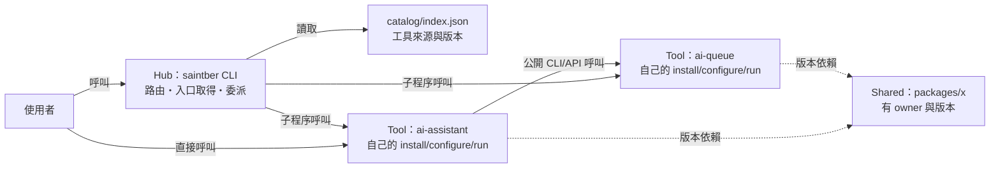
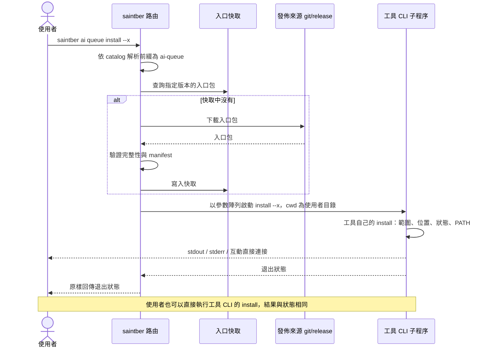
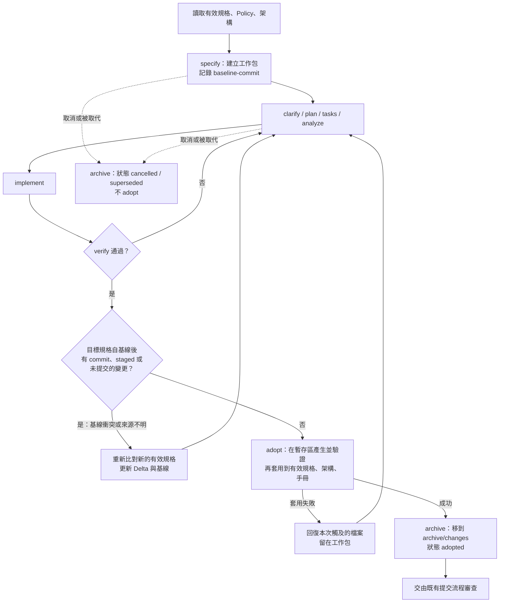

# Saintber.Forge 工具集入口重整設計

| 項目 | 內容 |
|---|---|
| 文件狀態 | **待正式落地的設計稿**。尚未搬遷任何內容，本文描述的 CLI、腳本、Policy 與流程也都還沒實作 |
| 日期 | 2026-10-06 |
| 撰寫 | Claude（整合 `design_claude.md` 與 `design_codex.md`） |
| 審閱 | Codex 第 1、2 輪審閱及修正核對完成；雙方取得共識（設計審閱完成，**尚未**經使用者正式採納，也未執行遷移） |
| 使用者裁決 | ① 各 Node 工具可以有自己的 `private: true` `package.json` 和 lockfile；不啟用 workspaces；只有 Hub 發佈 npm 套件<br>② Hub 最低 Node.js 版本為 24，以明確的 major 清單加上平台測試矩陣管理；各工具自己定義 runtime |
| 原稿 | `design_claude.md`、`design_codex.md` 保留供比較；本文採納後，兩份原稿和本文都移到 `archive/governance/design/`（§15.2） |

> 閱讀方式：§1–§3 是概念，§4–§9 是結構與 CLI，§10–§13 是文件、治理與 Spec Kit，§14–§16 是發佈、遷移與落地。
> 文中「建議」是設計提議；「決策」是使用者已確認的事項，彙整在 §17；「待驗證」是落地時要實測的假設。

---

## 1. 背景與目標

### 1.1 背景
- 本 repo 原本是 `Saintber.Forge` 命名空間下的探索性小工具集合（.NET / Blazor Server），已用 Spec Kit 完成 `001-portal-home`。
- 新的專案和舊工具都會繼續用 Spec Kit 開發。

### 1.2 新目標
- 本 repo 改為**工具集入口（Hub）**，提供 `saintber` CLI 讓使用者發現、安裝、設定、啟動各工具。
- 各工具的初期開發也在這裡進行；規模變大後遷到獨立 repo，但仍可透過 `saintber` 取得與呼叫。
- 已規劃的工具：

| 工具 ID | 說明 |
|---|---|
| `forge-explorer` | 原 Saintber.Forge 探索性工具集，繼續開發並改名（.NET 命名空間與 `.sln` 檔名這次不改） |
| `ai-assistant` | AI 助理 |
| `ai-queue` | AI 工作佇列 |
| `ai-skills` | AI 技能，同時包含**可安裝的技能資源**與**可執行的技能能力** |
| `pwsh-tools` | 使用者可安裝的 PowerShell 工具 |
| `node-tools` | 使用者可安裝的 Node.js 工具 |

工具 ID 一旦對外發佈就保持穩定。還沒開始開發的工具只列在路線圖，不預先建立空目錄。

### 1.3 設計原則
1. **Hub 與 Tool 互相不知道對方的內部**：Hub 只知道「工具在哪裡、怎麼呼叫」；工具只知道「收到什麼操作和參數」。
2. **工具自主**：每個工具自己持有 install / configure / run、狀態、安裝範圍與技術選擇。可以直接呼叫，也可以經由 Hub 委派，兩種方式走同一套實作。
3. **可遷出**：工具目錄本身就是一個完整的專案（文件、治理、Spec Kit、套件定義都在裡面）。遷出時要處理的項目明確列出（§14.3），不假設單靠 `git subtree split` 就能獨立。
4. **單一真相**：同一個 capability 或 requirement 只有一份有效定義；同一份 Policy、同一份 Spec Kit 客製化只有一個正本。
5. **結構一致**：Hub 和每個工具的文件與 Spec Kit 結構相同，學一次就能套用到全部。

---

## 2. 名詞

| 名詞 | 定義 |
|---|---|
| **Hub** | 本 repo 的根專案：`saintber` CLI、catalog、bootstrap、共同治理、Spec Kit 客製化正本 |
| **Project** | `projects/<id>/` 下的開發與治理單位，擁有自己的 `.specify/`、Policy、文件 |
| **Tool** | 使用者看到的安裝對象，有穩定的 tool ID。一個 Project 通常對應一個 Tool |
| **Module** | 工具內可以單獨選擇的能力，例如 `ai-skills` 的某個技能或某個 adapter。由工具自己的 CLI 處理 |
| **Shared** | 跨工具共用、有 owner 與版本契約的函式庫（§6）。有實際需求才建立 |
| **入口包（entry package）** | 能執行某工具 install / configure / run 的最小可執行包。工具本體還沒安裝時，也能用它執行 install |
| **Profile** | 一組依序執行的 `saintber` 命令，用來一次建立多工具環境（§8.6）。它不是另一份工具實作 |
| **有效規格** | `docs/specifications/` 中已驗證並採納、代表「現在」行為的規格 |
| **工作包** | `specs/<NNN-name>/` 中進行中的 Spec Kit 變更提案 |

---

## 3. 責任邊界

### 3.1 三層責任

| 層級 | 負責 | 不負責 |
|---|---|---|
| **Hub** | catalog、巢狀命令路由、取得並驗證工具入口包、以子程序呼叫工具、轉交參數與結果、Hub 自身的 bootstrap、家目錄、alias、自我更新、入口快取；跨工具治理與 Spec Kit 客製化正本；使用者入口文件 | 工具的安裝位置、安裝範圍、設定格式、執行方式、模組語意、工具狀態、工具的 PATH |
| **Tool** | 自己的 CLI 與 install / configure / run（可以再加 status / update / uninstall / doctor）；自己的狀態、範圍、PATH、設定、資料；自己的 `AGENTS.md`、`.specify/`、Policy、文件、測試、套件定義 | 路由到其他工具；讀寫其他工具或 Hub 的內部檔案 |
| **Shared** | 有 owner、版本與公開 API 的共用程式碼 | 任何工具專屬的邏輯；直接被 Hub 路由呼叫 |

### 3.2 依賴規則
- 工具**不得**依賴 Hub `src/` 的內部實作，也不得從相鄰工具的目錄載入程式（例如 `../ai-queue/src`）。
- 工具之間合法的互動方式有兩種：
  - **公開 CLI / API 契約**：例如 `ai-assistant` 呼叫 `ai-queue` 公開的 CLI 或 HTTP API。
  - **有版本的 Shared 套件**（§6）。
- 開發期的連結方式也必須遵守同一份契約，不能因為在同一個 repo 就走捷徑。
- 工具可以加嚴 Hub 的 Policy，但不能放寬（§11.4）。



圖的讀法：實線是**執行期的呼叫或讀取**（包含 Hub 讀取 catalog），虛線是**建置或套件依賴**。
- Hub 只往下呼叫工具，工具不會反過來呼叫 Hub。
- 工具之間只透過公開契約呼叫，或共同依賴有版本的 Shared。
- 使用者可以略過 Hub 直接使用工具，結果與經由 Hub 呼叫相同。

---

## 4. 根目錄（Hub）結構

```text
Saintber.Forge/
├─ README.md                      # 專案總覽、一行安裝指令、工具清單、文件入口
├─ AGENTS.md                      # Hub 層 AI 指引；說明如何選擇目標專案、進入 projects/<id> 後以該專案規則為準
├─ CONTRIBUTING.md                # 貢獻流程入口（連到 developer-guide）
├─ CHANGELOG.md                   # saintber CLI 的版本變更
├─ LICENSE                        # 授權類型另行決定
├─ package.json                   # Hub 的 npm 套件（name: saintber，bin: saintber）；唯一對外發佈的 npm 套件
├─ package-lock.json
├─ workspace.json                 # ★ 開發清單：本 repo 內有哪些專案、位置、狀態（§4.2）
├─ Saintber.code-workspace        # multi-root workspace（輔助用，見 §13.5）
│
├─ src/                           # saintber CLI 實作
│  ├─ cli/                        # 參數解析、Hub 自身選項、輸出、退出碼
│  ├─ catalog/                    # 讀取 catalog、解析工具來源
│  ├─ routing/                    # 命令前綴 → tool ID 對應
│  ├─ distribution/               # 取得、驗證、快取工具入口包
│  ├─ invocation/                 # 子程序呼叫、stdio、取消、退出狀態
│  ├─ runtime/                    # Node 版本檢查、更新提醒（§9.2）
│  ├─ profile/                    # Profile 執行（§8.6）
│  └─ home/                       # Hub 家目錄、shim、alias、自我更新
├─ tests/                         # 路由、呼叫契約、bootstrap 的測試與 fixtures
│
├─ catalog/
│  ├─ index.json                  # ★ 發佈索引：tool ID、命令前綴、來源、版本、入口包位置（§4.2）
│  └─ profiles/                   # 官方提供的 Profile 範例
├─ schemas/                       # manifest、catalog、workspace、Profile、呼叫契約的 JSON Schema（有版本）
│
├─ scripts/
│  ├─ bootstrap/                  # 給「使用者」：確保有 Node，再安裝或呼叫 saintber
│  │  ├─ install.ps1              # Windows
│  │  ├─ install.sh               # Linux / macOS
│  │  └─ README.md                # 參數與受限環境說明
│  ├─ dev/                        # 給「開發者」（Node .mjs，跨平台）
│  │  ├─ new-project.mjs          # 從 tooling/scaffold 建立新專案
│  │  ├─ sync-speckit.mjs         # 把 tooling/speckit 部署到各專案
│  │  ├─ build-catalog.mjs        # 由各專案的 manifest 產生 catalog 中的本地項目
│  │  └─ graduate-project.mjs     # 協助工具遷出（§14.3）
│  ├─ ci/                         # CI 用（唯讀、可在 PR 上跑）：依變動路徑派送、一致性檢查、打包的 dry-run
│  └─ release/                    # 發佈用（有副作用、需要憑證、只在 tag 觸發）：打包入口包、產生 descriptor、上傳（§14.2）
│     ├─ pack-entry.mjs           # 依 manifest 為某工具產生入口包與完整性雜湊
│     ├─ pack-shared.mjs          # 在 Shared 套件目錄執行 npm pack，產生 release tarball
│     ├─ update-catalog.mjs       # 產生 catalog descriptor 的變更，交由審查，不自動推到主線
│     └─ verify-release.mjs       # 下載已發佈的檔案，重新驗證雜湊與 manifest
│
├─ tooling/
│  ├─ speckit/                    # ★ Spec Kit 客製化的唯一正本（§13.6）
│  │  ├─ README.md                # 上游版本、客製化差異、產生與同步方式
│  │  ├─ UPSTREAM_VERSION         # 固定的上游版本
│  │  ├─ commands/                # 指令正本 → 產生 .github/prompts、.github/agents、.claude/commands
│  │  ├─ templates/               # 客製化模板
│  │  └─ scripts/                 # 專案解析、上下文、adopt、archive
│  └─ scaffold/                   # 新專案骨架（§5 的完整結構）
│
├─ packages/                      # Shared（有實際需求才建立，§6）
│
├─ docs/                          # Hub 層文件（§10）
├─ specs/                         # Hub 層進行中的工作包
├─ archive/
│  ├─ changes/                    # 已完成、取消或被取代的工作包與其輸入
│  └─ governance/                 # 被取代的憲章、設計稿等治理歷史
├─ .specify/                      # Hub 自己的 Spec Kit（處理 saintber CLI、catalog、共同治理）
├─ .github/                       # Hub 的 prompts / agents / workflows
├─ .claude/                       # Hub 的 Claude Code commands（由 tooling/speckit 產生）
│
└─ projects/
   ├─ forge-explorer/
   ├─ ai-assistant/
   ├─ ai-queue/
   ├─ ai-skills/
   ├─ pwsh-tools/
   └─ node-tools/
```

### 4.1 根目錄各區域的責任

| 區域 | 誰使用 | 責任 |
|---|---|---|
| `src/`、`tests/` | Hub 開發者 | saintber CLI 本體 |
| `catalog/` | saintber、使用者 | 「到哪裡取得哪個版本的工具入口」 |
| `workspace.json` | 開發腳本、Spec Kit、代理 | 「哪些專案在本 repo 內開發」 |
| `schemas/` | Hub 與工具 | 共同契約格式；工具自己的內部 metadata 不在這裡 |
| `scripts/bootstrap/` | 使用者 | 唯一不依賴 Node 的區域：只負責準備 Node 和取得 saintber |
| `scripts/dev/`、`scripts/ci/` | 開發者、CI | 一般使用 Node `.mjs`，以便跨平台。`ci/` 唯讀，可以在 PR 上執行 |
| `scripts/release/` | 發佈流程（tag 觸發） | 有副作用（建立 release、上傳檔案）、需要憑證，**不得**在 PR 上執行。只負責「產出並發佈入口包」，**不部署任何工具**：工具的部署由工具自己決定，所以 Hub 沒有 `cd/` |
| `tooling/` | 開發者 | Spec Kit 客製化與專案骨架的正本 |
| `archive/` | 追溯用 | 預設不被當成現行需求讀取 |

### 4.2 `workspace.json` 與 `catalog/index.json` 的分工

兩份檔案回答不同的問題，內容不得互相推定：

| | `workspace.json` | `catalog/index.json` |
|---|---|---|
| 回答 | 原始碼**在哪裡開發** | 使用者的命令**指向哪個入口包** |
| 內容 | 專案 ID、相對路徑、狀態（incubating / graduated）、owner | tool ID、命令前綴、來源類型（local-dev / git / release）、版本、入口包位置與完整性資訊 |
| 誰用 | Spec Kit 專案解析、`scripts/dev`、代理 | saintber CLI |
| 遷出後 | 移除該專案，或標為 graduated 並指向外部 repo | 改指向外部發佈來源；tool ID 與命令前綴不變 |

`workspace.json` 也是**明確的 workspace 識別**：工具的流程靠它找到 Hub，不靠「往上找到某個資料夾」來推測。

```json
{
  "schemaVersion": 1,
  "workspace": "saintber-forge",
  "projects": [
    { "id": "hub", "path": ".", "status": "active" },
    { "id": "forge-explorer", "path": "projects/forge-explorer", "status": "incubating" },
    { "id": "ai-queue", "path": "projects/ai-queue", "status": "incubating" }
  ]
}
```

---

## 5. 每個工具專案的結構

```text
projects/<id>/
├─ README.md                      # 工具簡介、獨立安裝與經 saintber 安裝的對照
├─ AGENTS.md                      # 該專案的 AI 指引
├─ CHANGELOG.md
├─ saintber.project.json          # ★ 工具 manifest：公開入口與呼叫契約（§7.4）
├─ package.json                   # 入口或本體使用 Node 時才有，放在工具根目錄：private: true，不發佈到 npm（§14.1）
├─ package-lock.json              # 各自的 lockfile
├─ <Name>.sln                     # .NET 工具的 solution 放在工具根目錄（例如 forge-explorer 的 Saintber.Forge.sln）
├─ <id>.code-workspace            # 單獨開啟這個專案用（輔助）
├─ .specify/                      # 自己的 Spec Kit（憲章、模板、腳本）
├─ .github/  .claude/             # 自己的 prompts / agents / commands（由 tooling/speckit 產生）
├─ docs/                          # 結構與 Hub 的 docs/ 相同（§10）
├─ specs/                         # 自己的工作包
├─ archive/changes/               # 自己的封存
├─ src/                           # 自己的 CLI（install/configure/run/...）與功能實作
├─ assets/                        # 資源（例如技能文件、模板），有需要才建立
├─ scripts/                       # 工具專屬的打包、包裝腳本
└─ tests/
```

- 套件與 solution 定義檔（`package.json`、`.sln`）放在**工具根目錄**；`src/` 內部的配置由工具依技術自訂（例如 `.csproj` 子目錄、`.psd1` module、Node 模組）。
- 每個工具一定會有 `AGENTS.md`、`.specify/`、`docs/governance/policy/`、文件、CLI 和自己的狀態。
- `pwsh-tools`、`node-tools` 初期是一個工具底下有多個模組。某個模組需要獨立版本、Policy 或發佈節奏時，再升格成獨立專案，不讓目錄層級無限遞迴。
- `ai-skills`：
  - `assets/skills/` 放可安裝的技能資源。
  - `src/` 放可執行的技能能力與目標代理的適配。
  - 兩類可以共用公開的技能 ID，但各自持有自己的規格。

---

## 6. Shared（`packages/`）

Shared 是跨工具共用的程式碼。它要能被帶出 repo，所以有比一般目錄更嚴格的規則：

| 項目 | 規則 |
|---|---|
| 建立時機 | 至少有**兩個實際消費者**、而且需要共同演進時才建立。只是「以後可能共用」不建立 |
| owner | 每個 Shared 套件有明確的 owner，記在它的 README 和 `workspace.json` |
| 契約 | 有公開 API 文件、semver 版本、CHANGELOG；不相容的變更要升 major |
| 套件定義 | 需要時可以有自己的 `private: true` `package.json` 與 lockfile；**不發佈到 npm**（只有 Hub 發佈 npm，§14.1） |
| 消費方式 | 不得用相對路徑 import 原始碼。初期採以下其中一種，並在消費者的文件中寫明：<br>(a) **release tarball**：在 Shared 套件目錄執行 `npm pack`（`private: true` 不影響 pack），把產生的 `.tgz` 掛在 GitHub release（tag `shared-<name>@x.y.z`）；消費者在 `package.json` 以該 tarball 的 URL 作為依賴，完整性雜湊（`integrity`）由 **lockfile** 記錄；這不是 URL 與雜湊並列的依賴字串語法<br>(b) **打包（bundle）**：消費者在建置入口包時把 Shared 打包進去<br>(c) **vendoring**：複製一份到消費者內，標示來源版本，只能整份更新，不得就地修改 |
| 不可用的方式 | **不得**用 npm 的 git dependency 指向本 monorepo（例如 `git+https://...#shared-x@1.2.0`）：npm 只會讀取 repo **根目錄**的 `package.json`，取得的會是 Hub 套件，不是 `packages/x`（[npm：Git URLs as dependencies](https://docs.npmjs.com/cli/v11/configuring-npm/package-json/#git-urls-as-dependencies)）。只有當 Shared 已經是**獨立 repo、根目錄就是該套件**時，才可以使用原生 git dependency |
| 開發期 | 可以用 `file:` 連結加快開發，但入口包與遷出版本必須改成 (a)、(b)、(c) 其中一種 |
| 遷出 | 遷出的工具改用 Shared 的 release tarball，或在遷出時 vendoring。**單純 subtree split 不會帶走 Shared**，必須列在遷出清單 |
| 其他發佈方式 | 例如私有 npm registry，以後需要時再另行決策 |

跨工具互動**不強制**經過 Shared：公開 CLI / API 契約同樣是合法的解耦方式（§3.2）。

---

## 7. 巢狀 CLI 與呼叫契約

### 7.1 命令形狀

> 以下是設計範例，命令還沒實作。

```text
# Hub 自身的命令
saintber list                          # 列出 catalog 中的工具
saintber info <tool-path>              # 顯示工具說明、來源、版本、支援平台
saintber status [<tool-path>]          # 查詢工具狀態（委派給工具，§8.3）
saintber profile run <file|name>       # 執行 Profile（§8.6）
saintber cache list|clean              # 管理入口快取（不會移除工具）
saintber alias add|remove|list         # 管理短名稱（§9.4）
saintber self-update [--node]          # 更新 saintber（§9.5）
saintber self-move <new-path>          # 搬移 Hub 家目錄（§9.3）
saintber self-uninstall                # 移除 saintber（§9.5）
saintber doctor                        # 檢查 Hub 自身環境（Node、PATH、家目錄）

# 委派到工具（前綴由 catalog 註冊）
saintber ai assistant install [工具參數...]
saintber ai assistant configure [工具參數...]
saintber ai assistant run [工具參數...]
saintber ai queue install [工具參數...]
saintber ai skills resources install [工具參數...]
saintber ai skills actions run [工具參數...]
saintber forge-explorer run [工具參數...]
```

- `ai assistant`、`ai queue`、`ai skills` 是 catalog 註冊的**命令前綴**，對應 tool ID `ai-assistant`、`ai-queue`、`ai-skills`。`ai` 這種純分類群組只用來導覽，不虛構安裝或執行行為。
- Hub 解析出前綴後，把**剩下的參數原樣交給工具**。`resources install`、`actions run` 這類工具內的子命令由工具自己解析。
- 每個可操作的子項目都提供自己的 install / configure / run。模組由工具的 CLI 派送到模組自己的實作；資源型模組也提供能說明或執行對應操作的入口。
- 工具前綴不得與 Hub 自身命令名稱（`list`、`info`、`status`、`profile`、`cache`、`alias`、`self-*`、`doctor`）重疊。
- 直接呼叫與委派等價：

```text
saintber ai assistant install [參數...]    ≡  <ai-assistant 的 CLI> install [參數...]
saintber ai assistant configure [參數...]  ≡  <ai-assistant 的 CLI> configure [參數...]
saintber ai assistant run [參數...]        ≡  <ai-assistant 的 CLI> run [參數...]
```

### 7.2 呼叫流程



圖的讀法：
- **Hub**：解析前綴，確保入口包存在且通過驗證，再以子程序把參數交給工具。
- **工具**：實際的安裝、設定、執行都由工具完成。
- **輸出**：直接連到使用者的終端。
- **退出狀態**：原樣回傳。

入口包取得或驗證失敗時由 Hub 報錯，並明確標示為 Hub 錯誤，與工具錯誤分開。

### 7.3 呼叫契約

下表是 Hub 與工具之間的共同規則，版本記在 manifest 的 `invocationVersion`。

| 面向 | 規則 |
|---|---|
| 路由 | 命令前綴必須唯一，拒絕有歧義的重疊前綴，避免新增工具時改變既有命令的歸屬。工具內部的子命令不由 Hub 逐一註冊 |
| 參數 | 以**參數陣列**啟動子程序，不拼接 shell 字串。保留參數的順序、空白、引號內容與 Unicode。含空白或 Unicode 的路徑是合法的，契約保證能正確傳遞，不以禁止這類路徑代替 |
| Hub 選項 | Hub 自己的選項（例如 `--entry-version`、`--offline`）只能放在工具前綴**之前**；前綴之後的一律屬於工具 |
| 工作目錄 | 保留使用者執行命令時的目錄。入口包的位置另外用絕對路徑解析，**不會**把工作目錄切到快取目錄 |
| 環境變數 | 原樣傳遞。Hub 只額外提供契約明定的少數資訊（例如 `SAINTBER_INVOCATION_VERSION`），工具**不得**依這些資訊改變業務行為 |
| stdio 與 TTY | 預設直接繼承 stdin / stdout / stderr，讓工具自行做互動詢問。是否支援非互動模式由工具宣告。契約只保證「繼承」；Windows 與 Linux 的 TTY 細節**待驗證**，不保證兩者完全一致 |
| 結果 | 原樣回傳工具的退出狀態，不改寫，也不要求工具避開任何數值。由於任何工具都可能回傳和 Hub 相同的數值，**不能只靠退出碼判斷錯誤來源**。Hub 自身的錯誤會在 stderr 加上 `saintber:` 前綴；需要機器判讀時，提供結構化輸出的來源欄位（例如 `--json` 下的 `source: "hub" \| "tool"`）。Hub 自身退出碼的配置在落地時決定 |
| 取消 | Hub 收到 Ctrl+C 時轉交給子程序並等待它結束。Windows 與 POSIX 的訊號語意不同，實際行為**待驗證**。子 CLI 結束不代表它啟動的長期服務已經停止，服務生命週期由工具管理 |
| help | `saintber --help` 只說明 Hub 命令與工具清單；工具前綴之後的 `--help` 交給工具 |
| 版本 | 入口包的版本與工具本體的版本分開。Hub 不會因為取得新的入口包，就默默變更已安裝的工具 |
| secret | 不建議放在 argv（行程清單看得到）。工具在 manifest 宣告支援的傳遞方式（環境變數、stdin、檔案路徑），Hub 原樣傳遞，不記錄、不快取 |

### 7.4 工具 manifest：`saintber.project.json`

manifest 只描述**公開入口與呼叫契約**。工具內部的模組、安裝目標等資料由工具自己解讀，Hub 不據此決定行為。

```json
{
  "schemaVersion": 1,
  "$schema": "https://raw.githubusercontent.com/<owner>/Saintber.Forge/<schema-tag>/schemas/saintber.project.schema.json",
  "invocationVersion": 1,
  "toolId": "ai-queue",
  "version": "0.1.0",
  "description": "AI 工作佇列",
  "commandPrefix": ["ai", "queue"],
  "entrypoint": { "runtime": "node", "file": "src/cli.mjs", "args": [] },
  "operations": ["install", "configure", "run", "status", "uninstall"],
  "runtimeRequirements": { "node": ["24"] },
  "platforms": ["win32-x64", "linux-x64", "linux-arm64"],
  "requires": { "tools": [{ "id": "ai-assistant", "range": "^0.2" }] },
  "secrets": { "transport": ["env", "stdin"] },
  "toolMetadata": {}
}
```

| 欄位 | 說明 |
|---|---|
| `schemaVersion`、`$schema` | manifest 格式版本。`$schema` 指向**有版本的網址**，不用 `../../` 相對路徑，遷出後仍然有效。Hub 以 `schemaVersion` 驗證 |
| `invocationVersion` | 工具支援的呼叫契約版本（§7.3） |
| `commandPrefix` | 建議的命令前綴；實際以 catalog 註冊為準 |
| `entrypoint` | runtime、入口檔案（相對於入口包根目錄）、固定的前綴參數；不得用來改變使用者的工作目錄 |
| `operations` | 至少包含 install、configure、run；強烈建議提供 status（§8.3） |
| `runtimeRequirements`、`platforms` | **入口**本身需要的 runtime 與支援平台，由工具自己定義（§7.5）。工具**本體**的 runtime 由工具的 install 處理，不寫在這裡 |
| `requires.tools` | 前置工具，**只作為資訊**（§8.5） |
| `secrets` | 支援的 secret 傳遞方式 |
| `toolMetadata` | 工具自用，Hub 不解讀 |

入口包的完整性雜湊記在 catalog，不記在 manifest，避免產生「manifest 含有自己所屬包的雜湊」的循環。工具發行時會產生該版本不可變的 manifest，使用者執行的是發行包，不是 repo 目前分支上的開發腳本。

### 7.5 入口的 runtime：安裝前就能執行

工具還沒安裝時，入口必須已經能執行，才能跑 install。**入口 runtime** 與**工具本體 runtime** 要分開看：

| 入口的形式 | 條件 |
|---|---|
| Node 入口 | **預設**使用 Hub 已確保存在的 Node（§9.2）。入口所需的 Node major 寫在 `runtimeRequirements`。如果與 Hub 的支援清單不同，並**不代表**系統上另一個可用的 runtime 必須被拒絕：已有符合工具要求的 runtime 時，依公開的入口設定使用；沒有時，由工具的可執行 wrapper 處理，或由 Hub 報錯並列出前提。Hub **不會**自動替工具安裝另一個 Node，以維持「Hub 的 Node 為 24、工具 runtime 自主」 |
| 自包含入口 | 例如單一執行檔、self-contained 的 .NET 發佈，不需要額外的 runtime |
| 工具自有的 bootstrap wrapper | 用已經可用的 runtime（Node，或 Windows 上的 PowerShell）寫成的包裝程式，由**工具**提供。它負責安裝工具本體需要的 runtime（例如 .NET），再進行實際安裝 |

- 入口需要的 runtime 不存在、而且沒有可以執行的 bootstrap wrapper 時，Hub **明確報錯**，並列出前提條件（來自 manifest）。
- Hub **不會**變成所有 runtime 的通用安裝器；Hub 只負責確保自己的 Node。
- 例：forge-explorer 的入口可以是 Node wrapper。它在 install 時檢查或安裝 .NET runtime，之後的 run 再呼叫 .NET 本體。

### 7.6 catalog 的來源描述

Hub 依 catalog 中**公開的來源描述（descriptor）**取得入口包，不從 tag 猜測子目錄，也不理解工具內部的建置方式。

```json
{
  "toolId": "ai-queue",
  "commandPrefix": ["ai", "queue"],
  "versions": {
    "0.1.0": {
      "source": {
        "type": "release",
        "url": "https://github.com/<owner>/Saintber.Forge/releases/download/ai-queue%400.1.0/ai-queue-entry-0.1.0.tgz",
        "integrity": "sha512-...",
        "manifestPath": "saintber.project.json"
      }
    },
    "0.2.0-dev": {
      "source": {
        "type": "git",
        "repo": "https://github.com/<owner>/Saintber.Forge.git",
        "commit": "<完整 commit SHA>",
        "entryRoot": "projects/ai-queue",
        "manifestPath": "saintber.project.json",
        "prepare": ["npm", "ci", "--omit=dev"]
      }
    }
  }
}
```

| 來源類型 | 規則 |
|---|---|
| `release`（優先） | 已打包好的入口包，加上完整性雜湊。下載、驗證、解壓後就能執行 |
| `git` | 必須寫明 repo、**固定的 commit SHA**（不用浮動的 branch 或 tag）、入口包根目錄的相對路徑、manifest 位置。如果入口需要準備（例如安裝依賴），`prepare` 必須是**工具公開宣告的包裝指令**，而且只能使用已經可用的 bootstrap runtime；Hub 只照著執行，不理解其內容。`prepare` 的工作目錄是**隔離取得的 `entryRoot`**，只有 `prepare` 使用；之後真正委派 install / configure / run 時，工作目錄仍是使用者的目錄（§7.3） |
| `local-dev` | 只用於開發期，指向本機的專案目錄 |

---

## 8. 工具的操作、狀態與範圍

### 8.1 操作的歸屬

| 操作 | 誰實作 | 說明 |
|---|---|---|
| install | 工具 | 解析版本、模組、安裝目標；檢查平台、前置需求、衝突；取得產物、驗證、暫存、套用；寫入自己的狀態 |
| configure | 工具 | 設定格式、讀寫、驗證，以及設定存放位置 |
| run | 工具 | 前景或背景、服務啟停、健康檢查、資源清理 |
| status | 工具（建議提供） | 是否已安裝、版本、模組、安裝位置 |
| update / uninstall / doctor | 工具（依需求宣告） | uninstall 只處理工具自己持有的檔案 |

工具不需要知道自己是被 Hub 還是被使用者直接呼叫；兩者走同一套實作、同一份狀態。

### 8.2 安裝範圍與位置
- **安裝範圍由工具決定，使用者依工具支援的參數選擇或覆寫。** 工具可以提供使用者、專案、系統、容器、指定路徑等任何合理的目標。
- Hub **不注入**統一的 `--scope`、不補預設目錄，也不把選擇限制在固定的幾類。
- 工具自己檢查權限與可用性。
- 工具的預設位置**不假設**在 Hub 家目錄內。使用者仍然可以把工具裝在 Hub 家目錄底下的子路徑；這時那些檔案仍屬於工具，Hub 不會因為它們位在家目錄內就取得處理權（§9.3）。

### 8.3 狀態：Hub 不持有工具的安裝狀態
- 工具的安裝狀態（版本、模組、來源、持有的檔案、設定、安裝目標）**只由工具自己保存**。
- 工具可以被直接安裝，所以 Hub **不能**用「沒有經過 Hub 安裝」判定工具未安裝。
- `saintber status [<tool>]`：
  - 對工具呼叫它公開的 `status`。
  - 工具沒有提供 status、還沒取得入口包、或查詢失敗時，顯示為 **`unknown`** 並附上原因。
- `saintber list` 只列出 catalog 的內容。如果提供 `--installed`，它只是對每個工具執行 status 後彙整，**不假裝知道所有工具的狀態**，`unknown` 會原樣顯示。

### 8.4 PATH 與 shim
- 工具需要放進 PATH 的指令由**工具自己**處理。
- Hub 只管理自己的 `<home>/bin`：`saintber` 本身和 alias（§9.4）。

### 8.5 工具之間的前置需求
- manifest 的 `requires.tools` 只是**資訊**：
  - Hub 在 `info` 中顯示。
  - 呼叫 install 前，Hub 可以用前置工具的 `status` 查詢並列出結果（可能是 `unknown`）。
  - Hub **不自動**排序或安裝前置工具。
- 實際的檢查由工具透過前置工具的**公開 CLI**（例如 `status`、`--version`）進行，不讀對方的內部檔案。
- 需要一次安裝多個工具時，用 Profile 明確寫出順序。

### 8.6 Profile

Profile 是依序執行的 saintber 命令清單。Hub 只負責依序執行，**不理解參數內容**：

```json
{
  "schemaVersion": 1,
  "name": "personal-ai-dev",
  "steps": [
    ["ai", "assistant", "install", "--scope", "user"],
    ["ai", "queue", "install", "--port", "8080"],
    ["ai", "queue", "configure", "--provider", "anthropic"]
  ],
  "onError": "stop"
}
```

- 這就是「主安裝程式可以代入參數」的做法：參數由使用者寫進 Profile，Hub 原樣轉交給工具。上例的 `--scope`、`--port` 是 ai-assistant、ai-queue **自己定義**的參數，不是 Hub 的參數。
- `catalog/profiles/` 放官方範例；使用者可以用 `saintber profile run ./my.json` 執行自己的 Profile。
- Profile **不得**包含 secret；secret 依 §7.3 的方式在執行時提供。
- 單一工具內的一鍵 setup 由工具自己提供，例如 `ai-queue setup`，不讓 Hub 猜測依賴順序。

### 8.7 失敗與回復
- 工具在失敗時回收這次操作中**可以撤銷**的部分。
- **不可撤銷**的系統變更（例如註冊系統服務），要記錄恢復步驟並寫進手冊。
- 設計上不宣稱任意安裝步驟都能完整 rollback。

### 8.8 AI 技能的額外要求
- 技能安裝要標示目標代理、技能格式、支援版本、同名衝突時的處理規則。
- 技能的通用來源，與轉換成目標代理格式後的輸出，要分開存放。
- **不得**把 Hub 的 Policy、`AGENTS.md` 或開發用的 `.specify/` 散布到使用者環境。

---

## 9. Bootstrap 與 Hub 自身

### 9.1 流程

```text
Windows：      irm <url>/install.ps1 | iex
Linux / macOS：curl -fsSL <url>/install.sh | sh
   │
   ▼
scripts/bootstrap/install.(ps1|sh)
   ├─ 確保有支援版本的 Node（§9.2）
   ├─ 選擇 Hub 家目錄（§9.3）
   ├─ 取得指定版本的 saintber（git clone 或 release 檔案）並驗證完整性
   ├─ 安裝 saintber 自己的依賴（npm ci --omit=dev）
   ├─ 建立 <home>/bin/saintber shim，並把 <home>/bin 加入 PATH（只加一次）
   └─ 若有附帶參數 → 轉交給 saintber，並回傳其退出狀態
```

- bootstrap 只處理 **Hub 自己**的前置條件，不另外維護一套工具路由或工具安裝的邏輯。
- `<url>` 初期用 GitHub raw 或 release 的網址；之後再考慮自己的網域，讓網址不受 repo 搬遷影響。
- saintber 初期透過 git clone 或 release 檔案發佈，穩定後再上 npm。

`irm | iex` 無法直接帶參數，文件要提供以下寫法：

```powershell
& ([scriptblock]::Create((irm <url>/install.ps1))) -Home 'D:\My Tools\saintber' -Alias sai -Yes
```

| bootstrap 參數 | 說明 |
|---|---|
| `-Home <path>` | Hub 家目錄（§9.3） |
| `-NodeStrategy auto\|system\|manager\|package\|portable` | 指定 Node 取得策略；預設 auto，依 §9.2 的順序 |
| `-Source git\|release`、`-Ref <tag>` | saintber 的來源與版本 |
| `-Alias <name>` | 同時建立短名稱 |
| `-NoPathUpdate` | 不修改 PATH |
| `-Yes` | 非互動模式，全部使用預設值 |
| 其餘參數 | 轉交給 saintber，例如 `profile run <file>` |

`install.sh` 提供對應的 `--home`、`--node-strategy` 等參數。

### 9.2 Node 取得策略（只適用 Hub）

Hub 的最低 Node 版本是 **24**（使用者決策）。
- **支援範圍**：以**明確的 major 清單**表示，初始為 `["24"]`，不寫沒有上限的 `>=24`。
- **加入新 major**：通過平台測試矩陣後才加入清單。
- **適用對象**：只有 Hub。各工具的 runtime 由工具在 manifest 自己定義。

| 順序 | 情況 | 做法 |
|---|---|---|
| 1 | 系統已有支援清單內的 Node | 直接使用，更新由使用者自己的環境負責 |
| 2 | 偵測到 fnm、nvm（含 nvm-windows）、volta | 用它們安裝並切換到支援清單內的版本 |
| 3 | 都沒有 | 用系統套件管理員安裝：Windows 用 `winget install OpenJS.NodeJS.LTS`；Linux 用 apt / dnf（版本不足時用 NodeSource）；macOS 用 Homebrew。之後隨系統一起更新。安裝後再確認版本在支援清單內 |
| 4 | 沒有權限或在受限環境（企業電腦不能用 winget、沒有 sudo） | **先詢問使用者**，同意後才從 nodejs.org 下載可攜版到 `<home>/node`，並校驗 SHASUMS256 |

- 可攜版只在安裝時下載，**不會進 git**。它不會隨系統更新，所以由 saintber 負責提醒：
  - `saintber doctor` 對照 nodejs.org 的版本清單，提醒版本過期或有資安修補。
  - `saintber self-update --node` 讓使用者手動更新。
- bootstrap 不會無條件安裝「最新版本」；安裝的版本必須在支援清單內。
- 平台測試矩陣（初始）：Windows x64、Linux x64、Linux arm64。macOS 與 Windows arm64 是否納入，另行決定。矩陣寫在 Hub 的 `tech-baseline` Policy。

### 9.3 Hub 家目錄
- 安裝時由使用者選擇。決定順序：`-Home` 參數 → `SAINTBER_HOME` 環境變數 → 互動詢問 → 預設值（`-Yes` 或非 TTY 時直接用預設值）。
- 預設值：Windows 為 `%LOCALAPPDATA%\saintber`，Linux / macOS 為 `~/.saintber`。
- 選定前會檢查：路徑可寫入；目錄是空的，或已經是 saintber 家目錄（重新安裝或修復）。含空白或 Unicode 的路徑是合法的，靠正確的參數傳遞處理，不予禁止。
- saintber 從**自己所在的位置**推算家目錄，之後不需要記住這個位置。`SAINTBER_HOME` 只用於覆寫或測試。
- `saintber self-move <new-path>`：只搬移 Hub 持有的項目（見下方清單）、重建 shim、更新 PATH。家目錄內不屬於 Hub 的內容（例如使用者選擇裝在這裡的工具）**保留在原位並提示**，不默默搬移；舊目錄只有在變成空的時才移除。

下方是 Hub **持有內容的預設布局**：

```text
<home>/
├─ app/          # saintber 本體
├─ bin/          # saintber 與 alias 的 shim
├─ node/         # 只有採用可攜版 Node 時才存在
├─ cache/        # 工具入口包快取（可以清除；清除不等於移除工具）
├─ config.json   # Hub 設定、aliases
└─ logs/         # Hub 自己的 log
```

所有權規則：
- Hub 只能操作**自己明確持有**的項目：上方清單中的項目、它建立的 shim、它加入的 PATH 項目。Hub 以安裝時記錄的清單（例如 `config.json` 中的 owned 清單）判斷所有權，不以「位在家目錄內」判斷。
- 所有權**不會往下繼承**：登錄某個目錄（例如 `app/`、`cache/`、`bin/`）只代表 Hub 持有它所記錄的項目，**不代表**其中所有未登錄的後代都屬於 Hub。位在這些目錄內的非 Hub 內容，不得因為父目錄被登錄就被連帶移除或搬移；`cache clean`、`self-move`、`self-uninstall` 都要保留並列出它們，父目錄因此非空時也保留。
- 家目錄是 Hub 內容的預設布局，**不代表** Hub 有權刪除其中的所有內容。
- 工具的本體、設定、資料、狀態放在哪裡，由工具自己決定（§8.2）；即使位在家目錄內，也屬於工具。

### 9.4 短名稱（alias）
- `saintber alias add sai`：在 `<home>/bin/` 建立 `sai` shim（Windows 為 `.cmd` 加 `.ps1`，Linux / macOS 為 symlink），並記錄在 `config.json`。
- 建立前用 `where` / `command -v` 檢查名稱是否已被占用；被占用時警告，並要求 `--force` 才建立。
- bootstrap 時可以用 `-Alias sai` 一起建立。`self-update` 會依 `config.json` 重建所有 shim。

### 9.5 自我更新與移除
- `saintber self-update`：更新 saintber 本體並重建 shim。`--node` 只適用於可攜版 Node。
- `saintber cache clean`：只清除 `<home>/cache/` 中 Hub 取得的入口包，**不是** uninstall，已安裝的工具不受影響。之後再呼叫工具時，Hub 會重新取得入口包。
- `saintber self-uninstall`：
  - 只移除 Hub **明確持有**的項目、shim、PATH 項目。
  - 家目錄內遇到非 Hub 的內容時保留並列出；家目錄只有在變成空的時才移除。
  - **不會**移除任何工具的本體、設定或資料，也不會自動呼叫工具的 uninstall。
  - 移除前提示：「工具請先用各自的 uninstall 移除，或保留下來繼續直接使用。」

---

## 10. 文件體系

### 10.1 結構（Hub 與每個工具相同）

```text
docs/
├─ README.md                      # 文件導覽：只導讀，不定義規則
├─ user-guide/                    # 使用手冊（給使用者）
│  ├─ README.md
│  ├─ getting-started.md
│  ├─ installation.md             # Hub：bootstrap、Node、家目錄、更新、移除；工具：自己的安裝範圍與參數
│  ├─ configuration.md
│  ├─ run.md
│  ├─ cli-reference.md
│  └─ troubleshooting.md
├─ developer-guide/               # 開發者手冊
│  ├─ contributing.md
│  ├─ speckit-workflow.md         # Hub 正本：客製化的 Spec Kit 流程；工具只放連結與專屬差異
│  ├─ adding-a-project.md         # Hub 專有
│  ├─ invocation-contract.md      # Hub 專有：工具 CLI 要實作什麼（§7.3）
│  ├─ releasing.md
│  └─ graduating-a-project.md     # Hub 專有：遷出流程（§14.3）
├─ architecture/                  # ★ 持久性的現行架構
│  ├─ overview.md                 # 元件與責任
│  ├─ data-flow.md                # 資料流與依賴方向
│  ├─ deployment.md               # 部署、啟動模式
│  ├─ cli-routing.md              # Hub 專有
│  ├─ tool-entrypoints.md         # Hub 專有
│  └─ decisions/                  # ADR
│     └─ 0001-hub-and-project-split.md
├─ governance/
│  ├─ README.md                   # 治理層級、繼承規則、憲章連結
│  └─ policy/                     # ★ §11
│     └─ README.md                # Policy 索引、繼承表、例外表
├─ intent/                        # Spec Kit 人類輸入
│  └─ <NNN-change-name>/
│     ├─ intent.md
│     └─ decision.md
└─ specifications/                # ★ 有效規格（§12）
   ├─ README.md                   # capability 索引
   └─ <capability>/
      └─ spec.md
```

### 10.2 文件分工

| 類別 | 讀者 | 回答的問題 | 時效 |
|---|---|---|---|
| 根 `README.md` | 所有人 | 這是什麼？怎麼裝？有哪些工具？ | 長期 |
| `user-guide/` | 使用者 | 怎麼安裝、設定、執行、排除問題？ | 隨發佈版本更新 |
| `developer-guide/` | 開發者 | 怎麼開發、發佈、遷出？ | 長期 |
| `architecture/` | 開發者與 AI | 系統**現在**怎麼組成、怎麼運作？ | 架構變更完成時更新 |
| `architecture/decisions/` | 開發者與 AI | **為什麼**選擇這樣做？ | 只新增；被取代時標示 superseded |
| `governance/` | 開發者與 AI | **必須**遵守什麼？ | 長期 |
| `intent/` | PM 與 AI | **為什麼**要做這次變更？ | 跟著工作包，完成後封存 |
| `specifications/` | 開發者與 AI | 系統**應該**有什麼行為（現行）？ | 長期，透過 adopt 更新 |
| `specs/<NNN>/` | AI | 這次要改什麼？怎麼做？ | 短期，完成後封存 |

三者的分工：
- **architecture**：描述「現在怎麼運作」。
- **policy**：描述「必須遵守什麼」。
- **ADR**：描述「為什麼這樣選」。

三者互相連結，但不重複寫同一條規則的全文。

### 10.3 使用手冊的組成
- Hub 的 `user-guide/` 說明 bootstrap、Node、家目錄、alias、巢狀命令、Profile、更新與移除，並提供連到各工具手冊的索引。
- 各工具的 `user-guide/` 說明自己的安裝範圍、參數、設定、執行，並**同時寫出直接呼叫與經 saintber 呼叫的對照範例**。
- 工作包的 `quickstart.md` 是開發與驗證用的，不等於使用手冊；adopt 時把仍然有效的操作整理進手冊（§12.4）。
- 之後若要產生文件網站，可以用腳本合併兩層 guide，不需要改目錄結構。

### 10.4 憲章
- 每個專案的憲章**唯一正本**是 `.specify/memory/constitution.md`；`docs/governance/README.md` 只放連結，不放副本。
- Hub 憲章只放原則：
  - 工具自主
  - 可遷出
  - 公開契約
  - 規格唯一
  - Policy 具約束力（§11.3）
  - 治理修訂程序
- 目錄配置、Node 版本、平台矩陣、manifest 格式、測試規則這類**具體規範**放在 Policy 或契約文件，不放進憲章。

---

## 11. Policy

### 11.1 問題
目前本地的 Spec Kit 流程只有憲章（`.specify/memory/constitution.md`）會被各指令明確讀取，**缺少一份明確載入與檢核持久 Policy 的契約**。實務上，`/speckit.constitution` 也常把具體的技術規範判定為「不屬於憲章」而改寫或刪除。上游是否已經提供相關功能，依固定的上游版本評估（§13.2），本文不做一般性的斷言。

因此 Policy 要有**自己的位置**，並且**明確接進 Spec Kit 流程**。

### 11.2 位置與格式
- 位置：`docs/governance/policy/`，Hub 和每個工具都有。
- 每份 Policy 開頭使用 frontmatter：

```yaml
---
id: POL-TEST-001
title: Testing Governance
status: active                  # draft | active | deprecated
scope: workspace                # workspace | distribution | hub-only | project
applies-to: [specify, clarify, checklist, plan, tasks, analyze, implement, adopt]
owner: saintber                 # 有權核准例外的人或角色
rationale: ../../architecture/decisions/0003-testing.md   # 可選
supersedes: []
---
```

| scope | 適用對象 |
|---|---|
| `workspace` | 所有在本 repo 內開發的專案（例如目錄結構、規格生命週期） |
| `distribution` | 透過 saintber 發佈與呼叫的這條鏈上的**雙方**：Hub 的發佈與呼叫責任，以及工具（**包含已遷出的工具**）的契約責任 |
| `hub-only` | 只約束 Hub 本身（例如 Hub 的 Node 版本） |
| `project` | 只約束該工具自己 |

- `applies-to` 列出**哪些 Spec Kit 階段**必須讀這份 Policy，包含 specify、clarify、checklist，不只 plan 之後的階段。
- `distribution` 類的 Policy 中，**每一條規則都要標明適用角色**：`[hub]`、`[tool]` 或 `[hub, tool]`。例如：
  - 「以參數陣列呼叫子程序」是 `[hub]`。
  - 「提供 install / configure / run」是 `[tool]`。
  - 「secret 不放 argv」是 `[hub, tool]`。

  這樣工具不會被要求實作 Hub 的路由，Hub 的 bootstrap 安全也不會被漏掉。

### 11.3 接進 Spec Kit
靠以下幾層**共同保護**，不依賴其中任何一層單獨成立（也不保證代理在任何情況下都不會判定超出範圍）：
1. **憲章只放一條治理引用原則**，不放 Policy 的內容：
   > 「`docs/governance/policy/` 中 status 為 active 的 Policy 具約束力。各階段依 `applies-to` 讀取並檢核適用的 Policy；任何違反都必須取得 owner 核准的例外。」
2. **共同的上下文載入步驟**（§13.4）負責讀取 Policy 索引，依 scope、角色和 `applies-to` 載入適用的 Policy。
3. **plan 模板**：「Constitution Check」改為「Constitution & Policy Check」，逐條列出 Policy ID 與檢核結果。
4. **analyze**：加入檢查 Policy 違反、未核准的例外、引用了 deprecated 的 Policy。
5. **驗收**：Spec Kit 升級或修改憲章後，確認引用原則仍然存在，而且 plan 的產出確實列出了 Policy Check（§13.5）。

### 11.4 繼承
```text
Hub 憲章
 └─ Hub Policy（workspace / distribution）    ← 工具必須遵守
     └─ 工具憲章                              ← 可以加嚴，不得牴觸
         └─ 工具 Policy（project）            ← 可以加嚴，不得放寬
```

- 工具的 `docs/governance/policy/README.md` 必須列出：
  - **繼承的 Hub Policy** 清單，以及**繼承基線**（Hub 的 commit 或 tag）。
  - 自己的專屬 Policy。
  - 已核准的例外。
- **workspace 模式**（工具在本 repo 內）：工具透過 `workspace.json` 找到 Hub，並驗證自己有登錄在其中（§4.2），不靠往上搜尋資料夾來推測。
- **standalone 模式**（工具已遷出，或單獨使用）：讀取工具**本地**的憲章、內化的 workspace Policy、版本固定的 distribution Policy 快照，**不要求**父 repo 或 Hub 的檔案存在（§11.6、§13.4）。
- 衝突時不採「離得近的優先」悄悄裁決：必須明確解決，或申請例外。
- Hub Policy 更新後，各工具在下一個工作包的上下文載入時，比對繼承基線並提示需要重新審查。

### 11.5 例外
- Complexity Tracking 裡寫的理由**只是紀錄，不等於核准**。
- 例外必須由該 Policy 的 **owner 核准**。初期 owner 是使用者本人，**代理不能自行核准**。
- 核准結果記在該專案 Policy README 的例外表：

| 例外 ID | Policy | 範圍 | 理由 | 核准者 | 日期 | 到期或重審條件 |
|---|---|---|---|---|---|---|

### 11.6 遷出後
- `workspace` 類 Policy：遷出時**內化**成工具自己的 Policy，並標示來源版本。
- `distribution` 類 Policy：遷出時在工具內保存一份**版本固定的快照**（例如 `docs/governance/policy/inherited/`，標示來源 tag），只遵守其中**對工具有義務**的規則，也就是標示 `[tool]` 與 `[hub, tool]` 的規則（雙方共同規則中，工具那一側的義務不可跳過）；只標示 `[hub]` 的規則不適用於工具。Hub 發佈新版本時，工具主動審查後才更新快照，不跟隨 main 分支的浮動內容。
- 不得留下指向舊父目錄的失效連結。共用文件（例如 `speckit-workflow.md`）同樣以版本化的快照或有版本的網址引用。

### 11.7 Hub Policy 清單

這是責任清單，依需要逐步撰寫；第一階段先寫 ★ 項目。

| ID 前綴 | 檔案 | scope | 範圍 |
|---|---|---|---|
| ★ POL-STRUCT | `project-structure.md` | workspace | Hub 與工具的目錄、責任、依賴方向、遷出原則 |
| ★ POL-DOC | `documentation-governance.md` | workspace | 文件類別、唯一 owner、歷史資料規則 |
| ★ POL-SPEC | `specification-lifecycle.md` | workspace | 有效規格、工作包、基線、adopt、archive |
| ★ POL-SPECKIT | `speckit-workflow.md` | workspace | 專案選擇、必讀上下文、模板、上游版本、客製化 |
| ★ POL-INVOKE | `invocation-contract.md` | distribution | [hub] 路由、入口取得、參數與結果轉交、取消轉交；[tool] 實作 install / configure / run、宣告契約版本與 secret 傳遞方式 |
| POL-INSTALL | `installation-contract.md` | distribution | [tool] 自己持有安裝、設定、狀態、範圍；[hub] 不注入範圍、不保存工具狀態、只操作自己持有的檔案 |
| POL-TECH | `tech-baseline.md` | hub-only | Hub 的 Node 支援清單（24）、平台測試矩陣 |
| POL-SEC | `security-baseline.md` | distribution | [hub] bootstrap 與入口包的來源驗證、完整性、寫入路徑；[tool] 安裝寫入、secret、最小權限 |
| POL-TEST | `testing-governance.md` | workspace | Hub 與工具的驗證責任、平台矩陣 |
| POL-RELEASE | `release-policy.md` | distribution | [hub] catalog 與 descriptor 維護；[tool] 版本、相容性、入口包發佈、遷出後的來源維護 |
| POL-DOD | `implementation-definition-of-done.md` | workspace | 程式、規格、文件、發佈產物同步的完成條件 |
| POL-SHARED | `shared-packages.md` | workspace | Shared 的建立時機、owner、版本、消費方式（§6） |

---

## 12. 規格生命週期：有效規格、工作包、封存

### 12.1 三層

| 層 | 位置 | 意義 | 狀態 |
|---|---|---|---|
| 人類輸入 | `docs/intent/<NNN-name>/intent.md`、`decision.md` | 這次為什麼做、限制、這次的取捨 | 跟著工作包 |
| 工作包（變更提案） | `specs/<NNN-name>/` | 這次的候選規格、研究、計畫、任務、驗證 | `draft` → `in-progress` → `verified`；或 `cancelled` / `superseded` |
| 有效規格 | `docs/specifications/<capability>/spec.md` | 已驗證並採納、代表**現在**的行為 | `active` |
| 封存 | `archive/changes/<NNN-name>/` | 歷史紀錄 | `adopted` / `cancelled` / `superseded`，唯讀 |

- `docs/specifications/` 與 adopt、archive 流程是**本專案的擴充**，不是 Spec Kit 原生功能。
- 工作包沿用 Spec Kit 原生的 `specs/<NNN-name>/` 形狀，減少對腳本的修改。

### 12.2 「規格唯一」的定義
唯一的是**同一 capability 與 requirement ID 的有效定義**，不是整個 repo 只能有一個 `spec.md`。

- **以 capability 劃分**：有效規格以長期的 **capability** 劃分，不以 feature 或 branch 劃分。同一個 capability 被 N 次變更修改後，有效規格仍然只有一份。
- **owner**：每個 capability 只有**一個 owner 專案**。例如：
  - Hub 擁有 `cli-routing`、`entry-distribution`、`invocation`。
  - 工具擁有自己的 `installation`、`configuration`、`execution` 等 capability。
  - 工具的安裝規則**不在** Hub 規格中重複定義。
- **requirement ID**：每條 requirement 有**穩定 ID**（例如 `REQ-INV-003`）。ID 不重用；刪除的 ID 在 Change Log 標示 removed。
- **工作包**：工作包的 `spec.md` 是**提案**，明確標示 pending，不得被當成現況引用。
- **封存**：封存內容預設**不被讀作需求**，只有追溯歷史時才明確讀取。
- **手冊與程式註解**：用 ID 或連結引用 requirement，不另外宣告一套規格。
- **公開契約**：同一份公開契約只有一個 owner，其他工具引用指定的版本。

有效規格格式：

```markdown
---
capability: invocation
owner: hub
status: active
last-adopted: 007-cancel-forwarding
---
# Invocation

## Requirements
### REQ-INV-001 參數以陣列傳遞
...（只描述「現在」的行為）

## Change Log
| Date | Change | Requirements | Summary | Archive |
|---|---|---|---|---|
| 2026-11-02 | 007-cancel-forwarding | +REQ-INV-009, ~REQ-INV-004 | 轉交取消訊號 | archive/changes/007-cancel-forwarding |
```

`docs/specifications/README.md` 是 capability 索引，至少包含：capability ID、owner、一句話說明、最後一次採納的變更。需要機器查詢時，從各規格的 frontmatter 產生，不另外維護一份手寫的 JSON。

### 12.3 工作包內容

```text
specs/002-selective-install/
├─ context.md          # 目標專案、適用的 Policy、讀取的有效規格與 baseline-commit
├─ spec.md             # 提案：Affected Capabilities 與 Delta（ADDED / MODIFIED / REMOVED requirement IDs）
├─ research.md
├─ plan.md             # 包含 Constitution & Policy Check
├─ data-model.md       # 有需要才建立
├─ contracts/          # 這次的契約提案（不是另一份有效契約）
├─ tasks.md
├─ quickstart.md
├─ checklists/
└─ verification.md     # 這次的驗證結果、已知缺口
```

- 修改既有 capability 時，候選 spec 對既有行為只用**引用**，集中描述差異與驗收條件。
- 新的 capability 第一次建立時，可以寫完整的候選規格；adopt 後才成為有效定義。
- 輸入檔名統一使用小寫 `intent.md`、`decision.md`。
- 如果沿用「單檔多版本」的 Intent 格式，流程**只讀** Current Effective Intent，歷史段落不得被當成現行需求。

### 12.4 流程



圖的讀法：
- **verify 失敗**：回到工作包修正。
- **verify 通過後檢查基線**：如果目標規格在這段期間有任何變更（已 commit、已 staged、或工作目錄中尚未提交），必須重新比對，必要時重新驗證，不能直接用舊提案覆寫（§12.6）。
- **沒有衝突**：先 adopt，再 archive。adopt 套用失敗時，回復本次觸及的檔案，回到工作包處理。
- **完成後**：變更留在工作目錄，交由既有的提交流程審查；adopt 和 archive **不會**自行 stage 或 commit。
- **取消或被取代**：直接封存，**不會**修改有效規格。

### 12.5 adopt 與 archive 的規則
**adopt**（新增指令，§13.4）：
- 前提：`verification.md` 的結論是通過，而且基線檢查沒有衝突。
- 動作：
  - 把 Delta 合併進 `docs/specifications/<capability>/spec.md`，並更新 Change Log。
  - 檢查 requirement ID 有沒有重複、有沒有被刪除後又重用。
  - 必要時更新 `docs/architecture/` 與 `user-guide/`。
  - 長期的決策提示寫成 ADR，或更新 Policy。

**archive**（新增指令）：
- 封存結構：

```text
archive/changes/002-selective-install/
├─ archive.md       # 狀態、日期、change ID、來源路徑、baseline-commit、交付版本
├─ inputs/          # 原 docs/intent/002-selective-install/
└─ work/            # 原 specs/002-selective-install/ 的完整內容
```

- `archive.md` **不記錄** adopt 所在的 commit hash：一個檔案無法記錄包含它自己的那個 commit。需要時以 change ID 從 git history 查詢（例如 `git log -- archive/changes/<id>`）；若要補記，只能在後續的 commit 中另外補上。
- 目標已存在時**拒絕覆蓋**：先比對內容，相同就視為已完成，不同就報錯。重複執行是安全的（可以重試）。
- 清除這個工作包的**活動上下文**，避免之後的指令還找舊的 `specs/` 路徑。
- 現行的導覽改指向封存位置，必要的舊索引只保留轉址說明。
- `cancelled` / `superseded` 的工作包只封存，**不 adopt**；不可覆蓋與可重試的規則同樣適用。

**套用方式與失敗處理**（adopt 與 archive 共通）：
- 先在**暫存區**（例如 `.specify/tmp/<change-id>/`，不提交）產生完整的變更結果，並完成驗證：requirement ID、連結、目標是否存在、基線檢查。
- 驗證通過後，才套用到工作目錄。
- 套用中途失敗時，**只回復本次觸及的檔案**到執行前的狀態，不覆蓋使用者原有的修改，也不清理整個工作目錄。
- 成功後，變更留在工作目錄，**不自行 stage 或 commit**，交由既有的提交流程審查。
- 建議把 adopt 與 archive 的結果放在**同一個可審查的 commit** 中提交。這是「提交單位」的建議，**不是**工作目錄的原子性保證。

**編號**：新工作包的編號要同時掃描 `specs/` 與 `archive/changes/`，**編號不重用**。

### 12.6 並行修改
- 兩個工作包修改同一個 capability 時，**先 adopt 的那個更新基線**。
- 後完成的那個在 adopt 前的基線檢查會失敗，必須：
  1. 重新比對新的有效規格。
  2. 調整 Delta。
  3. 必要時重新驗證。
- 檢查範圍（只針對本次指定的 capability 規格檔，不檢查整個工作目錄）：
  - **已 commit**：`baseline-commit` 到 HEAD 之間的變更。
  - **已 staged**：index 中的變更。
  - **未提交**：工作目錄中尚未 staged 的變更，以及新建的有效規格檔。
- 先辨識哪些變更是**本工作包準備的 Delta**，哪些是**其他來源**的修改。有衝突或來源不明時，就停止並重新比對，**不覆蓋**。
- 在暫存區驗證完、真正套用之前，**再檢查一次**，避免檢查與套用之間又有新的變更。
- 與目標 capability 無關的使用者變更不受影響，也不會被清理。

---

## 13. Spec Kit 在多專案中的運作

### 13.1 本地舊版與上游新版
| | 本地現有版本 | 上游（依官方 monorepo guide） |
|---|---|---|
| 專案根目錄解析 | `common.ps1` 的 `Get-RepoRoot` 優先使用 `git rev-parse --show-toplevel`；`create-new-feature.ps1` 還**另外**有 `Find-RepositoryRoot`，也會呼叫 `git rev-parse` | 優先使用**最近的** `.specify/` |
| 指定目標專案 | 不支援 | `SPECIFY_INIT_DIR` 指向成員專案；路徑無效或沒有 `.specify/` 時直接報錯，**不退回**根目錄 |
| 編號 | 掃描所有 branch 與 `specs/` | 每個專案的 `specs/` 各自編號；branch 命名空間仍然共用 |
| branch 檢查 | `Test-FeatureBranch` 要求 `^[0-9]{3}-` | 待確認 |
| 憲章繼承 | 無 | 無（官方明確說明不提供） |
| 支援的起始版本 | — | 官方頁面**沒有寫明**，落地時要查 release notes |

上游欄位的來源：[Spec Kit monorepo guide（GitHub 原始文件）](https://github.com/github/spec-kit/blob/main/docs/guides/monorepo.md)、[發佈版](https://github.github.com/spec-kit/guides/monorepo.html)。這份文件在 main 分支上會持續變動，落地時要以**固定的上游版本**重新核對。

結論：
- **只改 `common.ps1` 不夠**，兩處根目錄解析都要處理。
- 上游的能力要依固定版本評估。

### 13.2 路線選擇
- **路線 1（優先）**：選定並固定一個支援 monorepo 的上游版本（記在 `tooling/speckit/UPSTREAM_VERSION`）。先評估升級的差異，再用 preset（模板）與 extension（adopt、archive、context 等新能力）加上本專案的客製化。
- **路線 2（備案）**：如果升級會破壞既有客製化，就維持本地版本，集中修改兩處根目錄解析與編號邏輯，並把升級列為後續工作。

兩條路線都必須滿足：
- 執行前回報**目標專案 ID、專案根目錄、change ID、產出路徑**。
- 明確指定的目標專案無效時**報錯**，**不退回** Hub。
- 不在本設計落地時直接執行全量的 init 或 upgrade，以免覆蓋既有的模板和代理指令。

### 13.3 branch 與編號
- 單一 repo 的 git branch 是共用的，不會因為每個工具都有 `.specify/` 就變成獨立。
- 建議 branch 命名為 `<project-id>/<NNN-name>`，例如 `ai-queue/003-retry-policy`、`hub/001-cli-routing`。
- 若採路線 2，要一起修改：
  - `Test-FeatureBranch`：接受可選的 scope 前綴。
  - `Get-FeatureDir`：去掉 scope 後再對應到 `specs/<NNN-name>`。
  - 編號掃描：只看該專案的 `specs/` 與 `archive/changes/`。
- 若採路線 1，依上游行為評估是否仍需要 scope 前綴，避免 branch 撞名。
- 不讓代理只靠 branch 名稱或「最新的數字」猜測目標，以 context（§13.4）為準。活動上下文屬於本機狀態，不提交到 git。

### 13.4 共同上下文載入與新增指令
所有相關的 slash command 開始前執行相同的上下文載入步驟。有兩種模式：

| 模式 | 何時使用 | Policy 來源 |
|---|---|---|
| **workspace** | 目標專案在本 repo 內，並登錄在 `workspace.json` | 目標專案的憲章與 Policy 索引，加上 Hub 的 Policy 索引（workspace 類與 distribution 類） |
| **standalone** | 工具已遷出，或單獨使用工具目錄、沒有 workspace | 工具**本地**的憲章、內化的 workspace Policy、版本固定的 distribution Policy 快照（§11.6），以及本地部署的 Spec Kit 指令與腳本。**不要求**父 repo 或 Hub 的檔案存在 |

步驟：
1. 解析並確認目標專案（明確指定 → `SPECIFY_INIT_DIR` → 目前目錄最近的 `.specify/`）。找不到就報錯。
2. 決定模式：
   - 明確指定 workspace，或從目標往上找到 `workspace.json` 時：驗證目標專案有登錄在其中，採 **workspace 模式**；沒有登錄就報錯。
   - 找不到 `workspace.json`，而且沒有明確指定 workspace 時：採 **standalone 模式**。
   - **明確指定**的 workspace 或專案無效時一律報錯，**不偷偷降級**成 standalone，也不退回 Hub。
3. 依模式讀取憲章與 Policy 索引（見上表）。
4. 依 scope、角色與本階段的 `applies-to` 載入適用的 Policy、相關架構文件、跨工具契約。
5. 讀取相關的有效規格（先讀 `docs/specifications/README.md` 索引）與本次的 intent / decision。
6. 把實際讀取的檔案路徑與 `baseline-commit` 寫入 `context.md`，讓 plan、analyze、implement 引用同一份上下文。

新增的自訂指令（目前都**還不存在**）：

| 指令 | 用途 |
|---|---|
| `speckit.context` | 執行上述上下文載入；其他指令也會內部呼叫 |
| `speckit.adopt` | 依 §12.5 把工作包合併進有效規格 |
| `speckit.archive` | 依 §12.5 封存工作包；也處理 cancelled / superseded |

原有的 `speckit.specify` 等指令透過客製化加入上下文載入，使用者不需要每次手動列出 Policy。

### 13.5 slash command 的發現與驗收
- 指令能否被發現，取決於代理產品、版本與工作區的開法：
  - GitHub Copilot 主要讀工作區根目錄的 `.github/prompts`。
  - Claude Code 讀啟動目錄的 `.claude/commands`。
- multi-root `.code-workspace` **不保證**指令作用在正確的專案。
- 做法：
  - **主要路徑**：在 Hub 根目錄使用指令，由指令選擇目標專案（§13.4 第 1 步），再載入該專案的上下文與腳本。
  - **輔助路徑**：單獨開啟 `projects/<id>/`（或它的 `.code-workspace`），或在該目錄啟動 Claude Code，使用專案自己的指令。
- **驗收項目**（每種代理、每次升級 Spec Kit 都要跑）：
  - 從 Hub 根目錄指定 `ai-queue`，產出只出現在 `projects/ai-queue/`。
  - 指定不存在的專案時報錯，不在 Hub 建立任何檔案。
  - 單獨開啟工具目錄時，指令解析到該工具。
  - 在沒有父 repo 的工具副本中執行指令：以 standalone 模式運作，不讀取任何父路徑。
  - Copilot 與 Claude Code 兩種格式的指令行為一致。
  - 修改憲章或升級 Spec Kit 後，Policy 引用原則仍在憲章中，plan 產出仍包含 Policy Check（§11.3）。

### 13.6 客製化正本與同步
- `tooling/speckit/` 是**唯一正本**：
  - 指令只寫一份，產生 `.github/prompts`、`.github/agents`、`.claude/commands` 三種格式。
  - 模板與腳本也只有一份。
- `scripts/dev/sync-speckit.mjs` 負責部署到 Hub 和各專案。
- 同步時**不覆蓋**：
  - 各專案的憲章（`.specify/memory/constitution.md`）
  - 專屬的模板覆寫（固定位置，例如 `.specify/templates/overrides/`，優先順序高於共同模板）
  - 專屬 Policy、有效規格、工作包
- 各專案的 `.specify/` 記錄同步來源的版本，CI 檢查是否一致。
- 不得同時手改正本和各專案的副本，共同檔案一律由正本部署。

---

## 14. 套件、發佈與遷出

### 14.1 套件定義（使用者決策）
| 對象 | 規則 |
|---|---|
| Hub | 根目錄 `package.json`（`name: saintber`），是**唯一對外發佈的 npm 套件**（穩定後才發佈；初期用 git / release） |
| Node 工具 | 有自己的 `package.json`，設為 **`"private": true`**，保存**自己的 lockfile**，不發佈到 npm |
| 非 Node 工具 | 依自己的技術（`.sln`、`.psd1` 等）；如果入口是 Node，同樣使用 private 的 `package.json` |
| Shared | 依 §6，需要時有自己的 private `package.json`，不發佈到 npm |
| workspaces | **不啟用**。每個專案各自執行 `npm ci` |
| 依賴宣告 | 工具的依賴**只寫在**自己的 `package.json`，不重複寫進根目錄的 devDependencies 或 manifest |

### 14.2 版本與發佈
- 每個工具獨立使用 semver（寫在 manifest，Node 工具也寫在 `package.json`），tag 格式為 `<tool-id>@x.y.z`。
- Hub 的 tag 是 `saintber@x.y.z`；Shared 的 tag 是 `shared-<name>@x.y.z`；schema 有自己的版本 tag。
- 工具的**入口包**優先以 GitHub release 檔案提供；也可以用固定 commit 的 git 來源。catalog 以公開的 descriptor 記錄這些資訊（§7.6）。
- Shared 以 `npm pack` 產生的 release tarball 提供（§6）。不使用指向本 monorepo 的 npm git dependency。
- 工具需要從原始碼建置時，由工具自己說明並執行；Hub 不依賴工具的內部目錄或建置步驟。
- 開發期可以把本地專案以 `local-dev` 來源註冊到 catalog，一般使用者則使用已發佈、可固定版本的入口包。
- **發佈流程**（`scripts/release/`，由 tag `<tool-id>@x.y.z` 觸發）：
  1. `pack-entry.mjs`：依該版本的 manifest 產生入口包，計算完整性雜湊。Shared 用 `pack-shared.mjs`（§6）。
  2. 建立 GitHub release，上傳入口包。入口包的下載網址由 tag 與檔名決定，可以在上傳前算出。
  3. `update-catalog.mjs`：把 `{url, integrity, manifestPath}` 寫成 catalog descriptor 的變更（§7.6），**交由審查**，不自動推到主線。catalog 是使用者取得工具的唯一來源，變更必須被看過。
  4. `verify-release.mjs`：從發佈的位置重新下載，驗證雜湊與 manifest，確認使用者實際拿到的就是發佈的內容。
  - 發佈需要憑證，只在 tag 觸發的流程中提供，**不在 PR 上提供**。
  - **不部署工具**：Hub 只發佈入口包。工具如何部署（例如 forge-explorer 的 Blazor 放到哪裡）由工具自己決定，不屬於 Hub 的 CI/CD。
  - 發佈到 npm 是**以後**的事（只有 Hub）；做的時候再新增腳本，不預先建立。
- CI（`scripts/ci/`，唯讀）：
  - 發佈流程中的 `pack-*` 在 CI 以 `--dry-run` 執行，確認每個工具與 Shared 都**可以被打包**，但不上傳。
  - 依變動路徑只建置與測試相關的專案；`src/`、`schemas/`、`packages/`、`tooling/` 變動時擴大範圍。
  - 必跑檢查：
    - manifest 符合 schema。
    - Node 工具的 manifest `version` 與 `package.json` 的 `version` 一致。
    - catalog 中 `local-dev` 類型的項目都對應到 `workspace.json` 中登錄的專案。只檢查本地註冊的項目，**不要求**兩份清單完全相同，因為已遷出的工具可以只出現在 catalog。
    - Spec Kit 同步版本一致。
    - Shared 消費方式符合 §6。

### 14.3 遷出流程
遷出判斷依據：出現獨立的使用者、發佈節奏、團隊、runtime，或需要穩定的契約，不以程式碼行數判斷。

1. 以 `git subtree split --prefix=projects/<id>` 建立帶歷史的分支，push 到新 repo。
2. 由 `scripts/dev/graduate-project.mjs` 協助處理以下**必要清單**（單純 split 不保證獨立）：
   - Node 工具：確認 `package.json` 與 lockfile 在新 repo 根目錄可以獨立 `npm ci`。`private` 維持不變；是否改為發佈到 npm，屬於以後另行決策的事項。
   - Shared 依賴：改成 Shared 的 release tarball，或 vendoring（§6）。
   - `workspace` 類 Policy 內化；`distribution` 類 Policy 存成版本固定的快照（§11.6）。
   - `$schema` 等引用確認都指向有版本的網址（§7.4）。
   - 部署本地的 Spec Kit 指令與腳本（由 `tooling/speckit` 的固定版本產生），讓新 repo 可以用 standalone 模式運作（§13.4）。
   - `README.md`、`AGENTS.md` 中引用的共用文件（例如 `speckit-workflow.md`）改為本地快照或有版本的網址，不依賴 main 的浮動內容。
   - 清除所有指向父目錄的連結。
3. 在 Hub：
   - catalog 改指向外部的發佈來源，**tool ID 與命令前綴不變**。
   - `workspace.json` 標示 graduated。
4. 移除 Hub 中該專案的程式碼與有效規格，只保留遷移說明與發行索引，不在兩個 repo 並行維護兩份有效規格。
5. 驗收：
   - 新 repo 沒有父目錄也能建置、測試、使用 Spec Kit。
   - 使用者執行 `saintber <prefix> install` 時行為不變。
   - 直接呼叫工具的行為也不變。

---

## 15. 舊內容遷移

### 15.1 原則
- 用 `git mv` 保留歷史。
- **只改路徑**：.NET 命名空間 `Saintber.Forge.*` 與 `Saintber.Forge.sln` 檔名這次不改（使用者決策）；之後如果要改，另開工作包。
- 目錄搬移、治理重寫、Spec Kit 客製化是**三件可以分開審查的工作**，不混在同一個 commit。

### 15.2 對照表

| 現在 | 遷移後 | 備註 |
|---|---|---|
| `Saintber.Forge.sln` | `projects/forge-explorer/Saintber.Forge.sln` | 檔名不改 |
| `src/**` | `projects/forge-explorer/src/**` | 搬走後，根目錄的 `src/` 才給 saintber CLI 使用 |
| `tests/**` | `projects/forge-explorer/tests/**` | 包含 `run-rwd-tests.ps1` |
| `.specify/`（腳本、模板） | 先辨識哪些是上游原檔、哪些是客製化 → 正本放進 `tooling/speckit/` → 部署到 Hub 與 forge-explorer | 走 §13.2 的路線 |
| `.specify/memory/constitution.md` | `projects/forge-explorer/.specify/memory/constitution.md` | 依新的作用域檢視；Hub 另外撰寫新憲章 |
| `.github/prompts/`、`.github/agents/` | 由 `tooling/speckit` 重新產生 | `copilot-instructions.md` 含有其他專案名稱、結構與現況不符，要重建，不沿用 |
| `specs/001-portal-home/` | 經 §15.4 核對後 → `projects/forge-explorer/archive/changes/001-portal-home/work/` | 狀態 adopted |
| `docs/intent/001-portal-home/` | 同上 → `.../001-portal-home/inputs/` | 檔名改為小寫 `intent.md`、`decision.md`（Windows 上要透過中間檔名改大小寫） |
| `docs/plan/verification/001-portal-home.verify.md` | 同上 → `.../001-portal-home/work/verification.md` | 保留原內容 |
| （新增） | `projects/forge-explorer/docs/specifications/<capability>/spec.md` | 由 001 經核對後整理出有效規格，可能拆成多個 capability（例如 portal-home、tool-registration） |
| `docs/intent/Demo/` | 判斷是否為範例；是的話放到 `tooling/scaffold/docs/intent/_example/` | 避免被當成待實作需求 |
| `docs/intent/README.md` | 內容併入 `docs/developer-guide/speckit-workflow.md` | Hub 共用流程 |
| `docs/policy/project-structure.md` | `projects/forge-explorer/docs/governance/policy/` | .NET 專屬（InnerApi / OuterApi / Blazor） |
| `docs/policy/tech-baseline.md` | `projects/forge-explorer/docs/governance/policy/` | .NET 專屬 |
| `docs/policy/security-baseline.md` | 拆開：通用部分提煉到 Hub 的 POL-SEC，專屬部分留在 forge-explorer | 需要人工判斷 |
| `docs/policy/testing-governance.md` | 拆開：通用部分提煉到 Hub 的 POL-TEST，專屬部分留在 forge-explorer | 需要人工判斷 |
| `docs/policy/implementation-definition-of-done.md` | 通用部分提煉到 Hub 的 POL-DOD；.NET 細節留在 forge-explorer | 需要人工判斷 |
| `docs/constitution/constitution.md` | 刪除，改為連到正本 | 目前已和 `.specify/memory/constitution.md` **內容不一致** |
| `docs/README.md` | 改寫為 Hub 的文件導覽 | |
| `.gitignore` | 合併 Hub（Node）與各工具的產物、本機狀態、cache、secret 排除規則 | |
| `design_claude.md`、`design_codex.md`、`design.md` | 採納後移到 `archive/governance/design/`；結論分別寫入 Policy、架構文件、ADR-0001 | 避免設計稿成為另一份結構權威 |

### 15.3 步驟
1. 開分支 `hub/000-restructure`。
2. 記錄**遷移前基線**：在目前結構執行 `dotnet build` 與既有測試，保存結果。如果原本就有失敗，記為既有問題。
3. `git mv` 搬移 .NET solution、`src/`、`tests/` 到 `projects/forge-explorer/`。只修正路徑相關的引用（測試腳本、文件中的指令）。
4. 在新位置重跑相同的 build 與測試，和步驟 2 比對：**只有**新出現的失敗才算是遷移造成的。
5. 搬移 001 的工作包與輸入，依 §15.4 核對後封存，並建立 forge-explorer 的有效規格。
6. 拆分舊 Policy，建立 forge-explorer 的 Policy README（繼承表、專屬清單）。
7. 建立 Hub 的骨架：`workspace.json`、`catalog/`、`schemas/`、`scripts/`、`tooling/`、`docs/` 新結構。
8. 依 §13.2 選定 Spec Kit 路線，建立 `tooling/speckit/`，部署到 Hub 與 forge-explorer，執行 §13.5 的驗收。
9. 撰寫 Hub 憲章（用 `/speckit.constitution`）、ADR-0001、第一階段 ★ Policy、根目錄 README 與 AGENTS.md。
10. 封存設計稿（§15.2 最後一列）。

### 15.4 001-portal-home 的核對與已知證據缺口
- **現況**：`tasks.md` 中 T001–T049 **全部標示完成 [X]**。驗證紀錄中多項標示 PASS。
- **處理原則**：
  - 保存既有的完成紀錄，不宣告「尚未交付」。
  - 這一輪不要求全面重新驗證。
- **遷移前核對**：確認目前的檔案與當時紀錄的交付物一致，例如 tasks 提到的檔案都存在，並且在 `src/`、`tests/` 中找得到對應實作。
- **已知證據缺口**：驗證紀錄有證據品質問題，例如寫著「尚未移除 Seed Data 進行測試」卻標示 PASS。這類項目：
  - 在封存的 `archive.md` 與有效規格的 Change Log 中列為「已知證據缺口」。
  - 之後如果要補驗，另開工作包。
- **建立有效規格**：以 spec、程式碼、驗證紀錄三方核對的結果為準，不直接把候選規格整份複製成現況。

### 15.5 驗收情境
| # | 情境 | 預期 |
|---|---|---|
| 1 | 遷移後 build / 測試 | 與遷移前基線相比，沒有新增失敗 |
| 2 | 從 Hub 根目錄對 `ai-queue` 執行 specify | 產出只在 `projects/ai-queue/` |
| 3 | 指定不存在的專案 | 報錯，Hub 沒有任何產出 |
| 4 | adopt 後 | capability 只有一份有效規格，Change Log 指向封存位置，歷史沒有遺失 |
| 5 | 同一 capability 的兩個並行工作包；或目標規格有 staged / 未提交的變更 | 後 adopt 的那個被基線檢查攔下；不覆蓋任何變更 |
| 5a | adopt 套用中途失敗 | 只回復本次觸及的檔案；使用者原有修改保留；沒有自動 stage 或 commit |
| 6 | 直接呼叫與經 saintber 委派的 install / configure / run | 參數、狀態、安裝目標相同 |
| 7 | 工作目錄、含空白或 Unicode 的參數、互動、取消、退出狀態 | 在支援的平台上依 §7.3 驗證 |
| 8 | `saintber cache clean` | 工具本體與資料不受影響 |
| 9 | 工具直接安裝、沒有經過 Hub | `saintber status` 透過工具的 status 正確回報；工具沒有 status 時顯示 `unknown` |
| 10 | `saintber self-uninstall`、`self-move`，包含工具裝在 Hub 家目錄子路徑的情況 | 只處理 Hub 持有的項目；工具的本體與資料保留並列出 |
| 11 | 演練一個工具遷出 | 新 repo 以 standalone 模式開發、使用 Spec Kit，不依賴父路徑；`saintber` 的命令前綴與行為不變 |
| 12 | 入口 runtime 不存在，而且沒有 bootstrap wrapper | Hub 明確報錯並列出前提條件，不嘗試安裝該 runtime |

---

## 16. 落地階段

| 階段 | 內容 | 完成條件 |
|---|---|---|
| 1. 治理與結構 | §15.3 步驟 1–9 | 驗收 1–5 |
| 2. 呼叫契約與最小 CLI | saintber 的 list / info / status / 路由 / 入口取得 / 委派；先用一個簡單的 Node 工具實作 install / configure / run / status | 驗收 6–9 |
| 3. bootstrap | `install.ps1` → `install.sh`；Node 策略、家目錄、alias、self-update、self-uninstall | 驗收 10；平台矩陣通過 |
| 4. 其他工具 | ai-skills（資源型加可執行型）、forge-explorer 自己的入口（含 Portal 啟動，不寫進 Hub 路由）、其餘工具 | 各工具的 user-guide 有直接與委派的對照 |
| 5. 遷出演練 | 挑一個工具演練 §14.3 | 驗收 11 |

每個階段都用 Spec Kit 工作包進行（例如 `hub/001-cli-routing`），走完 §12 的生命週期。

---

## 17. 決策紀錄

### 17.1 使用者已確認

| # | 議題 | 決策 |
|---|---|---|
| 1 | 命名 | Hub 維持 `Saintber.Forge`；原工具改名 `forge-explorer` 並繼續開發；CLI 名稱 `saintber` |
| 2 | 頂層目錄 | `projects/` |
| 3 | 規格模型 | 有效規格、工作包、封存三層；有效規格以 capability 劃分 |
| 4 | AI 技能 | 同時有資源型與可執行型 |
| 5 | 入口形式 | 巢狀 CLI；每個可操作子項目提供自己的 install / configure / run，可以獨立呼叫，也可以由 saintber 委派 |
| 6 | 安裝範圍 | 由各工具決定，甚至由使用者決定，不由 Hub 決定 |
| 7 | Hub 的 Node 取得 | 沿用現有 Node → 版本管理工具 → 系統套件管理員 → 受限環境經詢問後使用可攜版；可攜版由 saintber 提醒與更新 |
| 8 | 短名稱 | 可透過 `saintber alias` 或 bootstrap 的 `-Alias` 啟用（例如 `sai`） |
| 9 | 套件 | 各 Node 工具有自己的 `private: true` `package.json` 與 lockfile；不啟用 workspaces；只有 Hub 發佈 npm 套件；工具提供 release（優先）或固定 commit 的 git 入口包；Shared 初期以 `npm pack` 的 release tarball、打包或 vendoring 消費 |
| 10 | saintber 發佈 | 初期用 git clone 或 release 檔案，穩定後再上 npm |
| 11 | 指令格式 | Copilot 與 Claude Code 指令由同一份正本產生 |
| 12 | Hub 家目錄 | 安裝時由使用者選擇 |
| 13 | Hub 最低 Node | 24；以明確的 major 清單加上平台測試矩陣管理；工具 runtime 由工具自己定義 |
| 14 | bootstrap 託管 | 初期用 GitHub raw 或 release 網址 |
| 15 | .NET 命名 | 這次只搬目錄，不改命名空間與 `.sln` 檔名 |

### 17.2 這份設計採用的主要方向（Claude 與 Codex 的共識）
- 主安裝程式「代入參數」的方式：Hub 原樣轉交參數，多工具組合用 Profile；Hub 不合併、不驗證工具參數。
- Hub 不保存工具的安裝狀態；狀態以工具公開的 status 為準，查不到時顯示 `unknown`。
- 工具之間的前置需求只是資訊，由工具自己檢查，多工具順序由 Profile 決定。
- 封存位置為 `archive/changes/`；有效規格位置為 `docs/specifications/`。
- Policy 的 scope 分為 workspace、distribution、hub-only、project；例外由 owner 核准。
- Spec Kit 優先評估固定的上游版本；本地修改時兩處根目錄解析都要改；指定的專案無效時不退回 Hub。
- 上下文載入分為 workspace 與 standalone 兩種模式；遷出的工具不依賴父 repo。
- adopt / archive 先在暫存區產生並驗證再套用，失敗只回復本次觸及的檔案，不自行 stage 或 commit；`archive.md` 不記錄自己所在的 commit。
- Hub 只操作自己明確持有的檔案；家目錄只是預設布局。
- 入口 runtime 與工具本體 runtime 分開；Hub 不是通用的 runtime 安裝器。

### 17.3 落地時要再決定或驗證的事
這些都**不阻擋**本設計的採納，會在對應階段的工作包中處理：
- Spec Kit 上游要固定哪個版本（§13.2）。
- 平台矩陣是否納入 macOS、Windows arm64（§9.2）。
- Windows 與 POSIX 在 TTY、取消訊號上的實際行為（§7.3）。
- Hub 自身退出碼的配置、契約提供的環境變數清單（§7.3）。
- 授權類型（LICENSE）。
