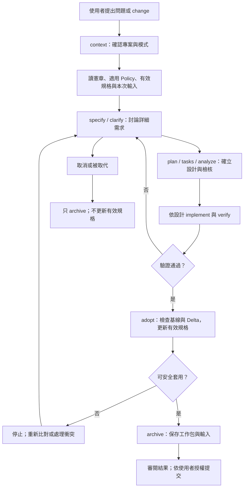
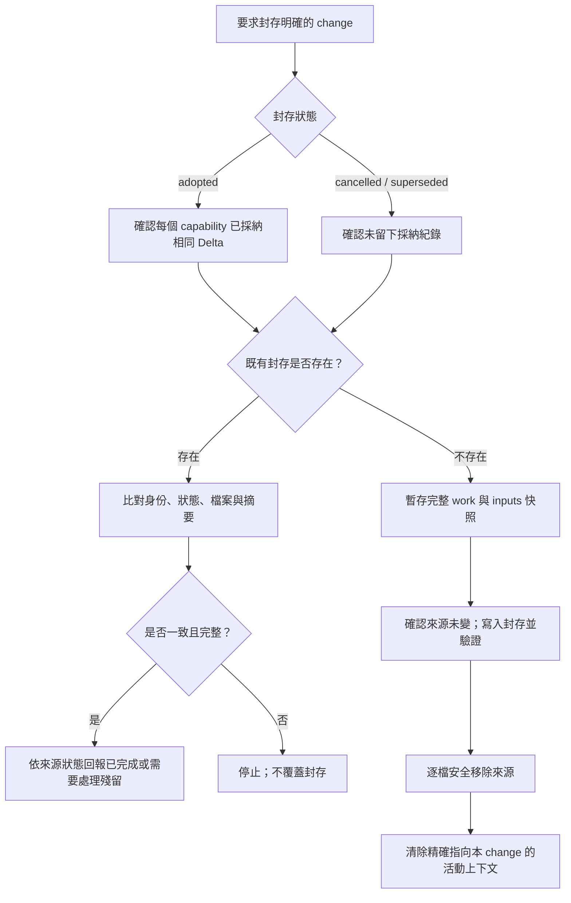
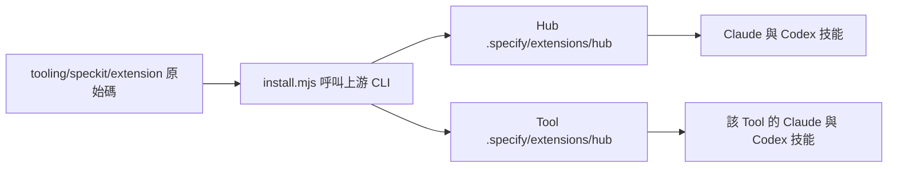

# Spec Kit 擴充完整設計稿

狀態：**待使用者確認的設計稿**，不是有效規格、Policy 或新增功能的開發授權。
整理日期：2026-10-07；整理者：Codex，依 Claude 的工作包與雙方審閱結果整理，交由 Claude 核對。
用途：集中說明完整構想、目前實作與尚未完成的部分，供使用者判斷是否符合預期。

這份設計先回答一個問題：如何讓每個專案用 Spec Kit 討論 change，同時讀到自己的治理與現行規格，最後安全地採納與封存？

本次遷移不再補齊所有構想，也不安排第二階段。**未完成功能保留設計與缺口，並未取消；資料安全缺陷仍須修正。** 使用者確認本稿後，仍以本次同意的交付範圍收尾；未來功能另開 Spec Kit change 討論詳細需求。

## 1. 先看目前做到哪裡

以下是整理當下的狀態，不能當作本次遷移已完成的驗收證明。

| 能力 | 完整構想 | 目前狀態 |
|---|---|---|
| 專案選擇 | 明確選 Hub 或 Tool，錯誤時停止 | `context` 已實作；有腳本測試與兩代理的限定驗收 |
| 讀取舊規格與 Policy | 各階段先讀適用治理、現行規格與本次輸入 | 腳本列出入口，技能要求代理讀取；尚未自動掛到所有原生階段，也沒有機械式證明代理讀完 |
| 工作包與有效規格分離 | 討論中的 change 不直接變成現況 | 目錄與治理已建立；上游候選 spec 需補上擴充契約才能 adopt |
| 採納有效規格 | 驗證後依 Delta 更新現況，保持 ID 唯一 | `adopt` 已實作，含內容保留、多 capability 與格式檢查；失敗回復缺陷已修正並有回歸測試，仍有 §10 的並行限制 |
| 封存與重試 | 留完整歷史，移除活動工作包，拒絕覆蓋 | `archive` 已實作；完整性、身份比對與回復不覆蓋並行新增已修正並有回歸測試；仍有 §9 的中斷重試限制 |
| plan 的 Policy Check | 列適用 Policy 與逐條結果；analyze 再查違反與例外 | 有治理要求，**沒有自動機制保證**；先前 preset 試驗不可直接採用（G-PC） |
| 編號不重用 | 同時考慮活動與封存工作包 | `context` 會給正確掃描結果；原生 specify 尚無強制接軌／衝突保護（G-NUM） |
| Claude、Codex 安裝 | 兩代理有相同三個技能，保留原預設整合 | `install.mjs` 已實作；先前安裝驗證通過，修正後仍須核對交付版本 |
| standalone | 遷出後僅靠自己的治理與規格即可工作 | 已驗證解析與產出隔離；**尚未驗證治理內化與完整遷出** |
| 完整代理流程 | 兩代理實際走完原生階段與 adopt/archive | 僅有下述限定情境；完整流程尚未驗證 |

**已完成的代理驗收範圍**：Claude 與 Codex 都做過無效專案、指定 `ai-queue` 的產出隔離，以及 standalone context。Codex 的 specify 情境因終端啟動失敗，以檔案工具等效建立輸出；這不能證明原生編號、branch、hooks 或 adopt/archive 的代理全流程。腳本測試與代理驗收分開記錄。

## 2. 要解決的問題與責任邊界

上游 Spec Kit 負責 specify、clarify、plan、tasks、analyze、implement 等工作包開發流程。本擴充補上「專案治理上下文」與「工作包轉成現況、再留下歷史」的流程。

| 對象 | 責任 |
|---|---|
| 使用者／相應 owner | 決定需求與範圍；批准架構、規範或公開契約的必要變更 |
| Spec Kit 原生技能 | 協助討論與建立候選 spec、plan、tasks，以及分析與實作 |
| 擴充技能 | 告訴代理如何選目標、讀文件、呼叫腳本，轉述錯誤而不繞過 |
| Node 腳本 | 執行可客觀檢查的解析、基線、ID、合併、封存與失敗處理 |
| 代理與審閱者 | 判斷需求語意、Policy 適用性、實作是否符合設計，以及驗證證據是否足夠 |
| Git 提交流程 | 審查並提交交付結果；擴充本身不 stage／commit |

**設計先於實作仍然成立**：新 change 可以在討論時發現總體設計不足，提出 ADR 或 Policy 修訂；實作應依該 change 已確立且獲授權的設計走。不能實作偏離後，倒過來修改文件把偏離合理化。

總體設計快照是方向與歷史參考，不是後續所有詳細需求的正確答案。這項定位同樣適用本擴充。

## 3. 文件放在哪裡，以及何者是現況

以下位置都以**目標專案根目錄**為起點。Hub 使用 repo 根目錄，Tool 使用 `projects/<id>/`。

```text
<project>/
├─ .specify/
│  ├─ memory/constitution.md        # 專案憲章
│  ├─ extensions/hub/               # 安裝後的擴充副本
│  ├─ feature.json                  # 本機活動上下文，不提交
│  └─ tmp/                         # 採納／封存暫存與失敗快照，不提交
├─ docs/
│  ├─ intent/<NNN-name>/            # 人類輸入：intent.md、decision.md 等
│  ├─ governance/policy/            # 長期規則與索引
│  ├─ architecture/                 # 現況架構、ADR 與待審設計稿
│  └─ specifications/
│     ├─ README.md                  # 現行 capability 索引
│     └─ <capability>/spec.md        # 唯一有效定義
├─ specs/<NNN-name>/                # 討論／開發中的工作包
└─ archive/changes/<NNN-name>/
   ├─ archive.md                    # 封存紀錄
   ├─ inputs/                       # 原人類輸入快照
   └─ work/                         # 原工作包完整快照
```

| 文件 | 如何閱讀 |
|---|---|
| `docs/intent/` | 讀本次的有效意圖；若同檔有歷史版本，使用 Current Effective Intent |
| `specs/` | 候選變更；審查後可作為本次實作基準，尚不是已交付現況 |
| `docs/specifications/` | 已驗證並採納的現行需求；後續 change 先從這裡讀 |
| `archive/changes/` | 歷史與證據，必要時追查；不預設把歷史需求載入成現行要求 |
| 架構、ADR、Policy | 長期架構與治理；變更需依各自程序，不由 requirement 合併器自動改寫 |
| 本稿 | 待確認設計；放在 `architecture/proposals/`，不提前拆成強制 Policy 或有效規格 |

規格「唯一」指同一 capability、同一 requirement ID 只有一個有效定義；允許多個工作包討論變更，歷史封存也可保留舊文字。capability 以行為責任劃分，例如 `speckit-context`，不以每次 branch 劃分。

**目前尚未具備**：自動選出舊規格中與需求相關的所有條款、解析 Current Effective Intent、多專案 capability owner 的全域唯一性驗證，以及封存歷史查詢指令。現階段主要靠索引、明確引用與代理審閱。

## 4. 整體使用流程



這張圖包含代理與人的流程，也包含腳本關卡；不表示目前每個箭頭都由程式自動銜接。尤其 `verify` 在此是驗證活動，**目前沒有新增 `speckit-hub-verify` 指令**。

## 5. context：專案與必讀上下文

Claude：`/speckit-hub-context [project]`；Codex：`$speckit-hub-context [project]`。上游 extension 的正式名稱是 `speckit.hub.context`，安裝後以技能名稱呼叫。

### 5.1 專案選擇

解析順序是明確的 `--project` → `SPECIFY_INIT_DIR` → 目前位置最近的 `.specify/`。明確指定 workspace 時也必須驗證它。指定不存在、未登錄或不合法的目標就停止，不退回 Hub，不偷偷改用 standalone。

- **workspace**：發現 `workspace.json` 且目標登錄其中。Tool 讀自己的憲章、Policy 索引與有效規格索引，另讀 Hub 的治理入口。
- **standalone**：找不到 workspace，依該工具本地治理與已內化／版本固定的規則運作；不能要求 Hub 文件仍存在。

模式解析會向上尋找 workspace；standalone 的意思是確定沒有 workspace 後，不把父 Hub 文件加入必讀清單，並非完全禁止任何父目錄探查。

### 5.2 回報與讀取

腳本只讀並回報專案 ID、根目錄、模式、解析來源、工作包產出位置、讀取入口、下一個建議編號。**腳本輸出讀取清單，不等於已讀文件內容**；技能要求代理接著讀取，依 Policy 的 scope、角色與 applies-to 展開適用內容，再讀相關有效規格與 intent。

完整構想是在每個相關階段都確認或延續相同上下文，記錄 `context.md` 與 baseline，避免切專案或改工作包後仍沿用舊目標。自動 hooks、適用 Policy 的解析器、必讀缺檔拒絕與上下文新鮮度檢查尚未完成；現在腳本只列存在的入口。

## 6. specify 與編號：接上原生流程

原生 specify 繼續負責建立候選規格與 checklist。擴充的完整構想是補上目標確認、舊規格引用、baseline、Affected Capabilities 與 Delta，再把產出留在該專案 `specs/`。

`context.nextChange` 目前會同時掃描活動 `specs/` 與 `archive/changes/` 的編號，回報最大值加一。但它**沒有預留編號、沒有建立工作包，也沒有強制原生 specify 使用該值**。兩個代理同時開 change，仍可能得到同一建議。

待討論的完整設計應決定：如何把建議編號傳給原生流程，以及建檔前如何拒絕重用或碰撞。可評估上游提供的明確 feature directory 或 hooks；尚未選定方案，不預設一定呼叫 `create-new-feature.ps1`、一定建立 branch 或新增一組自製指令。

在同一 repo，branch 是全 repo 共用，切 branch 不會只作用於某個 Tool。擴充不得因選擇專案就自行切換使用者工作分支。

## 7. Policy：讀取、檢核與例外

完整流程要在 specify／clarify 就知道適用規則，plan 列出 **Constitution & Policy Check**，analyze 再檢查違反、未核准例外與過時引用。不能只在最後驗收才發現設計違規。

建議的 plan 檢核表如下；這是設計示例，尚非新增的強制輸入 schema：

| 規則 | 適用理由 | 設計如何滿足 | 結果／待處理事項 | 例外的核准依據 |
|---|---|---|---|---|
| Policy ID＋條款 | scope、角色與本次操作 | 具體設計或引用 | 通過／不適用／有衝突／待核准 | owner 決策或無例外 |

機械檢查可判斷區段、引用與必填欄位是否存在；**不能因此證明語意符合 Policy**。語意由代理與審閱者判斷。缺少核准、規則衝突或把 deprecated 當 active 時，應依現有治理程序處理，不能由代理自行批准。

目前的 preset wrap 試驗會改寫核心受管理的 plan 技能，且只作用一個代理，因此沒有採用。完整需求仍保留（G-PC）；可再評估獨立 extension hook、template override 或其他上游機制，但必須先驗證兩代理一致性與升級相容性。**本稿不把任何替代方案當成已選定或本次必須補做。**

## 8. adopt：把候選差異變成有效規格

Claude：`/speckit-hub-adopt <NNN-name>`；Codex：`$speckit-hub-adopt <NNN-name>`。

### 8.1 目前腳本要求的工作包格式

以下嚴格格式是實作時選擇的機器契約，**不是使用者最初已討論完的詳細需求**。原生 Spec Kit 不保證直接產出它；需在採納前整理。是否接受這種維護方式，是本稿的重要審閱點。

```markdown
# Feature Specification: 本次變更

**Status**: pending
**Owner**: hub
**Baseline**: `abcdef0`
**Affected Capabilities**: speckit-context, speckit-archive

## Delta

### speckit-context
#### ADDED
##### REQ-SCTX-001 確認目標
本次新增的完整需求與驗收條件。

### speckit-archive
#### MODIFIED
##### REQ-SARC-002 可重試
修改後的完整需求定義。
#### REMOVED
- REQ-SARC-003
```

驗證文件目前須有這個區段，第一個條列以 `Done` 開始才通過：

```markdown
## Final Status
- Done
```

腳本檢查結論標記，**不會自行執行所有測試，也不會判斷證據是否足以支持 Done**。不得為了通過而改寫驗證結論；實際範圍與未驗證項目必須留在紀錄。

### 8.2 採納動作

1. 驗證 change／capability 路徑與工作包；取消或被取代的工作包不得 adopt。
2. 檢查驗證結論、Git baseline、Affected Capabilities 與 Delta 集合一致。
3. 檢查所有要寫入的有效規格與共用索引，自 baseline 至 HEAD、index 與工作目錄是否有變更。
4. 暫存產生整份結果；套用 ADDED／MODIFIED／REMOVED，檢查未知 ID、重複、刪除後重用與非空變更，保留未受影響的文件內容。
5. 更新各 capability 的 Change Log、`last-adopted` 與有效規格索引；新 capability 要有 owner。
6. 套用前再檢查目標，才逐檔寫入；失敗只處理這次觸及的檔案，不清理其他變更。

支援一個工作包在**同一專案**修改多個 capability。跨專案的採納交易與全域 owner 驗證未設計為現有能力；不要靠 Hub 工作包直接更新 Tool 的有效規格。

套用結果還會重新解析：ADDED／MODIFIED 的 ID 與內容必須確實存在，REMOVED 必須消失；例如需求被誤插入 code block，就應拒絕整次採納，而不是只看輸入語法通過。

**基線的實際保守程度**：共用 `docs/specifications/README.md` 也是寫入目標，因此另一個 capability 更新索引也可能使本次採納被拒絕；目前沒有語意合併這些無關索引修改。

### 8.3 完整設計的限制

採納器自動更新的是有效規格與索引，不會理解並自動修正架構、Policy、使用手冊或任務的語意。這些同步由本次工作包與審閱完成。

Change Log 新增 `Snapshot`，記錄採納時 Delta 的內容摘要，供 archive 判斷工作包是否後來被修改。這是安全實作新增的格式細節；不能把有相同 ID 當成內容相同。舊五欄 Change Log 可被讀取，但沒有 Snapshot 的舊紀錄不能直接滿足新 archive 的 adopted 證明；舊資料如何相容需要另外確認，不能強迫重採納全部歷史。

### 8.4 實作新增、尚未討論定案的格式限制

| 項目 | 目前腳本強制的規則 | 使用上的影響 |
|---|---|---|
| change ID | 至少三位數字，接小寫英數與連字號，如 `002-policy-check`；單一路徑片段，最長 100 字元 | 不符合就拒絕，不能自由使用中文或任意目錄名 |
| capability ID | 小寫英數 kebab-case，最長 100 字元 | 已有名稱若不符合，需先討論相容方式 |
| requirement ID | `REQ-` 接一個或多個大寫英數段，最後接數字，如 `REQ-AIQ-RETRY-001`；數字目前未限制三位 | 不是任意 ID，也不能把其他格式默默略過 |
| 有效規格 | frontmatter、`## Requirements`、`### REQ-…` 條款與 `## Change Log` | 原生 feature spec 不等於可直接合併的有效規格格式 |
| Delta | §8.1 的固定標題層級與操作名稱；拒絕空 Delta 或無法辨識的內容 | 目前沒有從原生 spec 自動轉換 Delta 的輔助，需由人或代理整理 |
| Owner 與 affected 集合 | 新 capability 必須明示 Owner；Affected Capabilities 必須與 Delta 的集合一致 | 不從目錄或自然語言猜測 owner／變更範圍 |
| Change Log | 舊五欄表頭與資料列升級為含 Snapshot 的六欄 | 會修改使用者原有效規格的表格文字，不只是追加一列 |
| 路徑與連結 | workspace 登錄不得越界；寫入／刪除路徑及工作包、intent 內的 symlink／junction 會被拒絕 | 即使某些連結仍指向專案內，目前也不接受 |

這些約束有安全或機器解析的理由，但具體語法是實作選擇。**不能只因已經寫了程式，就視為使用者已同意的需求。** 本稿列出來供確認；若改變格式，須同步調整解析器、測試與相容策略。

## 9. archive：保存完整歷史與清除活動上下文

Claude：`/speckit-hub-archive <NNN-name> [status]`；Codex：`$speckit-hub-archive <NNN-name> [status]`。status 是 `adopted`、`cancelled` 或 `superseded`，預設 adopted。



完整設計要求保留整個工作包及同名人類輸入；archive.md 留狀態、日期、change ID、baseline 與來源資訊，不記自己所在的 commit。腳本不 stage／commit；審閱後可把採納與封存放在同一提交。

目前加入逐檔 SHA-256 Manifest 與 metadata 摘要，避免來源刪除後重試時，把缺檔、不同內容或別的工作包誤認為原封存完整。**摘要是完整性比對，不是簽章或不容篡改的保證。** 新腳本不能憑無 Manifest 的舊封存宣稱同樣已驗證。

**重試的實際限制**：來源已移除、既有封存完整且身份正確時，回報已完成；若來源仍在且內容相同，目前回報 `SOURCE_NOT_REMOVED`，要求檢查殘留，並不自動完成刪除。來源與封存不同回報 `TARGET_DIFFERS`；工作包來源已移除但同名 intent 還在，回報 `INCONSISTENT`。圖中的回報路徑保留這些差異，不能把目前實作說成任意中斷點都能自動續跑。

`archive.md` 現在是機器可讀契約，包含固定欄位、`## Manifest` 表格與 `Metadata-Digest:` 行。手動修改其日期、baseline 或快照內容，會使重試驗證失敗。這是實作增加的約束；舊封存／手寫封存沒有這些欄位時，也不能直接通過新的完整性判定。

如果採納後修改 Delta，即使 requirement ID 相同，adopted archive 仍應停止；不能讓封存內容與已採納的需求相異。已採納一部分 capability 時，也不能把整個工作包改成 cancelled 封存。

封存成功後，只清除精確指向該 change 的 `.specify/feature.json`。若解析或清除失敗，須如實回報警告，不能假裝活動上下文已清空。其他文件中的歷史連結／導覽不由目前 archive 腳本全面重寫，須由收尾審閱同步。

## 10. 安全與失敗：哪些是必要修正

| 風險 | 完整設計要求 | 整理時狀態 |
|---|---|---|
| requirement 解析吞掉其他章節、把範例當需求 | 保留未變內容，辨認 fenced code，拒絕無法安全解析的 Delta | 已修改解析器，待最終回歸核對 |
| capability／change 路徑越界或 junction 導向外部 | 確認真實路徑；拒絕不合法路徑與不安全連結 | 有保護與測試；最終證據需列環境限制 |
| adopt 覆蓋別人的 staged／未提交內容 | 以 baseline 與套用前二次檢查攔下；保留無關檔案 | 已有腳本關卡與整合測試 |
| adopt 回復時，目標又被其他程序寫入 | 應辨認本次寫入與後續新內容；有衝突時保留新內容與恢復資料 | **已修正，有回歸測試**：比對內容後只回復本次寫入；衝突保留新內容及 before／after 暫存，回報 `ROLLBACK_INCOMPLETE`；比對與回復仍非原子操作 |
| archive 假認內容一致、缺檔或錯誤身份 | 比對完整快照、Manifest、change 與 status | 已在既有目標、暫存、寫入結果三處檢查；錯誤身份拒絕已有測試；Codex 已獨立重跑修正版 88 項腳本測試 |
| 封存刪除後回復覆蓋並行新增檔案 | 保留新內容與恢復快照，明確回報回復不完整 | **已修正，有回歸測試**：來源出現不同新內容時保留它與暫存快照，回報 `ROLLBACK_INCOMPLETE`；比對與還原仍非原子操作 |
| 半途失敗、暫存區殘留 | 不默默覆蓋殘留；有衝突保留快照與處理指引 | 已有機制，需以失敗注入驗證實際交付版本 |

這些要求保護使用者內容與封存正確性，仍屬已開始指令交付前要處理的缺陷，**沒有因本次收斂而取消**。

目前以「可捕捉錯誤時回復」為主，沒有跨程序鎖、交易日誌或斷電／強制終止後的自動復原保證。二次檢查不能消除所有競爭時間窗；不可宣稱檔案系統交易或任意並行寫入下都原子安全。adopt 暫存現已同時保存 before／after，回復不完整時保留供處理；這修正了先前恢復資料遺失的缺陷，不代表已具崩潰後自動復原。更完整的並行／崩潰模型須另開 change 討論。

## 11. 安裝、來源與升級

擴充原始碼在 Hub 的 `tooling/speckit/extension/`，安裝器在 `tooling/speckit/install.mjs`；每個專案 `.specify/extensions/hub/` 是安裝位置。共同開發邏輯不散落在每個專案的產生檔案裡。`--dev` 安裝後是複製或連結、原始碼更新是否會自動反映，尚未另行驗證，不能依賴自動同步。



現行基線是 Node.js 24、Spec Kit 1.1.0，腳本只用 Node 內建模組。每個專案有自己獨立的 `.specify/`、憲章與 Policy，使用同一擴充不代表共用一份專案上下文。

上游本地 extension 安裝一次只註冊給一個 active 代理；安裝器**每次對一個 `--project-dir`** 的已安裝整合，依序選 Claude、Codex 等代理，以 `specify extension add --dev --force <Hub 擴充原始碼目錄>` 安裝，再還原原預設整合，檢查兩代理技能與核心 manifest 的 modified／missing 為零。這是目前已採用的實作折衷，不手工編輯核心技能。

本輪安全修正後，Codex 已對 Hub 與 forge-explorer 分別重跑安裝：兩邊的 Claude／Codex 各 3/3 個技能，預設整合還原，受管理核心檔案 modified 0、missing 0。安裝與腳本驗證不等於完整擴充設計已定案。

升級使用上游 `specify integration upgrade`，之後對各目標專案重跑 install。治理、有效規格與工作包不得被安裝器覆蓋。遇安裝失敗要檢查實際狀態；目前不是所有安裝步驟都具有完整回復交易。

設計以 Windows／Linux 為目標；不能把跨平台 API 的使用等同兩平台全部驗收已完成。Tool 真正遷出後，擴充分發來源、版本固定與治理內化也還要另行設計；本次 standalone 解析測試不足以證明這些已完成。

## 12. 如何判定可交付，以及保留哪些後續事項

對目前三指令的必要交付檢查包含：需求解析的單元測試；專案、Git 基線、失敗回復與封存重試的隔離整合測試；安全缺陷的回歸；安裝副本與兩代理技能一致性；核心受管理檔案未被修改；文件與實際範圍相符。變異測試能提供關卡會攔下缺陷的額外證據，不能代替需求審查。

完整代理驗收要另外記錄實際操作與產出。原先 38 項測試是舊紀錄；adopt 回復修正後，Claude 與 Codex 各自執行 **88 項通過（單元 20、整合 68）**。不能因此推論原生流程或兩代理的全流程都通過。

變異測試的核對仍在收尾。Claude 已回報：移除「寫入後完整性驗證」的變異未被測試抓到，因為前面的快照內容比較已先攔下同類錯誤；**不能宣稱每道防線都已獨立證明有效**。

保留的後續事項沒有排期，也不代表已獲准直接開發：

- 各原生階段的上下文銜接、適用 Policy 載入與讀取紀錄。
- 自動 Policy Check／analyze 檢核接軌（G-PC），以及語意與機械檢查的界線。
- 原生 specify 的編號接軌、重用與碰撞保護（G-NUM）。
- 嚴格工作包格式、Snapshot／Manifest 的舊資料相容方案。
- 原生流程與 adopt/archive 的兩代理完整驗收。
- standalone 治理內化、擴充分發與真正的遷出演練。
- 若有實際需要，再討論跨程序並行、崩潰復原或跨專案交易。

未來使用者選擇一項時，以新 Spec Kit change 重新討論詳細需求；不直接把本稿或總體設計快照整份轉成實作任務。

## 13. 建議使用者先確認的設計取捨

這些是審閱焦點，**不是要求你一次回答所有問題**：

1. **自動化程度**：你期待 context 由人先呼叫、代理遵守流程即可，還是每個原生階段都要自動接上？目前是前者，後者未完成。
2. **採納方式**：是否接受以穩定 requirement ID＋嚴格 Delta 合併，而不是代理直接重寫整份有效規格？前者較可檢查，但需維護特定格式。
3. **封存與相容性**：是否接受內容摘要與 Manifest，並為舊資料另訂相容方法？這比原始方向更具體，尚不應讓舊工作包一律被迫重採納。
4. **完成定義**：是否接受先交付安全且限制清楚的三指令，保留 G-PC／G-NUM 等完整構想，之後逐項開 change？這符合目前指定的遷移收尾範圍。

若你希望更輕量，也可在確認後減少尚未實作的自動銜接或機器格式設計。變更安全要求與已批准治理的部分，則須清楚記錄相應取捨，不能只是忽略錯誤。

## 14. 來源與核對紀錄

- [採納時的總體設計快照](../decisions/0001-attachments/design-2026-10-adopted.md)：方向與歷史。
- [本次遷移範圍 ADR](../decisions/0002-migration-delivery-scope.md)：使用者指定的收尾範圍；不是取消未完成功能構想。
- [規格生命週期 Policy](../../governance/policy/specification-lifecycle.md)、[Spec Kit Workflow Policy](../../governance/policy/speckit-workflow.md)：現有治理；自動化缺口不代表既有規則失效。
- [001 工作包](../../../specs/001-stage1-speckit-extension/spec.md)、[研究](../../../specs/001-stage1-speckit-extension/research.md)：包含先前範圍與試驗，正在同步本次交付邊界，不優先於使用者的新指示。
- [擴充原始碼](../../../tooling/speckit/extension/)、[安裝器](../../../tooling/speckit/install.mjs)：目前實作，不代表全部設計已定案。
- [操作指引](../../developer-guide/speckit-workflow.md)、[遷移狀態](../../migration-status.md)：仍在收尾同步；正式交付時需與驗證紀錄一致。

核對紀錄：Codex 已依目前原始碼、001、Policy 與既有驗收範圍整理；Claude 於 2026-10-07 核對並提出七項現況修正、六項實作格式限制，本稿已補入。**這是雙方目前設計與差異的整理，使用者尚未確認；不等於程式交付驗收完成。** 本稿暫不採納、封存或提交為已批准需求。

使用者後續指定**優先完成主要遷移，不以確認本稿作為 worktree 並行開發的前提**。本稿可隨遷移保存提交為待審文件；001 工作包仍未採納／封存，不藉提交將提案變成有效需求。
