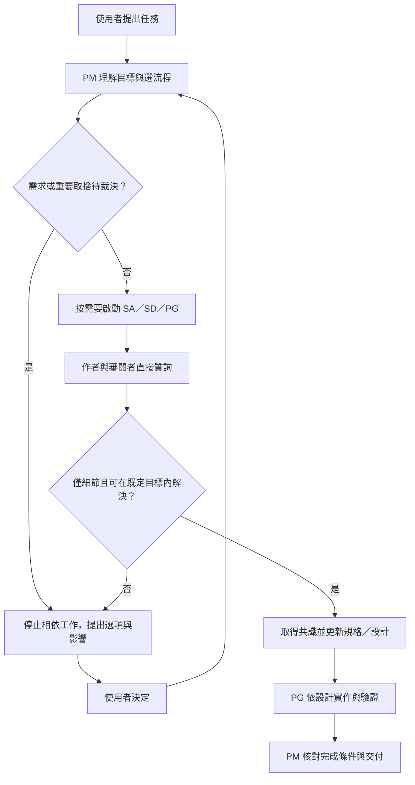
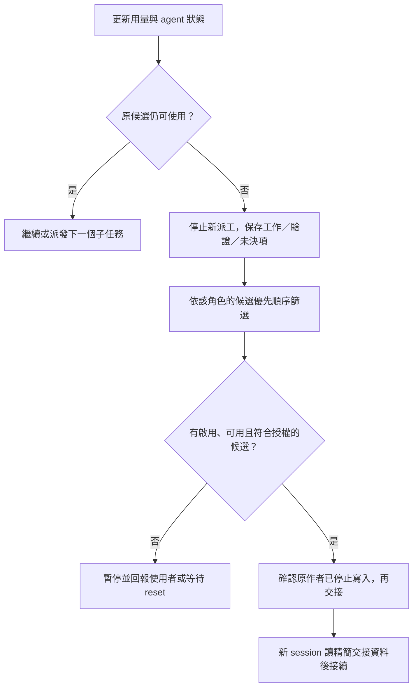

# 按任務啟動 AI 團隊：設計草稿

日期：2026-10-07。狀態：**待釐清，尚未實作**。這份文件保存本次需求分析，不是 Policy 或有效規格。目錄歸屬、個人訂閱切換授權、公司模型／預算策略正在詢問使用者；回答後才建立目標專案的 Spec Kit 工作包與實作設計。

初始角色／AI 設定草稿見 [task-team-config.example.json](task-team-config.example.json)。它是討論用設定，不是已可執行的工具。

## 1. 建議交付形式

採用 **skill + Node command**，但只有一份協作規則正本：

- `task-team` skill：說明何時啟動團隊、PM 怎麼組隊、角色互相審閱與使用者裁決流程。
- Node command：讀設定、驗證環境、建立 Herdr pane、啟動 CLI、保存狀態、觀測用量與執行交接。
- command 啟動 PM 時，把同一份 skill 與角色說明位置交給 PM；從 skill 啟動也呼叫同一 command，不另寫第二套規則。
- Claude 與 Codex 的技能部署由安裝腳本從正本產生／複製，不人工維護兩份邏輯，也不修改任何 `speckit-*`。

預期操作介面（**尚不可使用**）：

```text
node <team-command> start --task-file <任務文件> --cwd <工作目錄>
node <team-command> status --team <id>
node <team-command> watch --team <id>
node <team-command> decide --team <id> --request <id> --answer-file <決策文件>
```

`start` 預設只啟動一位 PM。PM 理解任務後才決定有哪些角色、先後與可併行的工作；不是一口氣啟動所有角色。`--dry-run`／`plan` 提供實際 pane 與 CLI 變更之前的檢視，純離線模式不讀取 Herdr，也不產生推論費用。

## 2. 歸屬選項

| 選項 | skill 正本與 command | 治理 |
|---|---|---|
| 開發輔助工具（建議先採用） | `tooling/skills/task-team/`、`tooling/team/`；設定在 `tooling/team/config/` | Hub 治理；Spec Kit 工作包在 Hub `specs/` |
| 可安裝產品 | 現有規劃中的 AI 工具集，優先討論 `projects/ai-assistant/` 的團隊能力 | 先確立其目的與自己的治理，再在其 `specs/` 開 change |

不建立獨立 `herdr` 或 `task-team` project。Node.js 是實作技術，不單靠語言把 AI 協調能力歸入 Node.js 工具集。既有 `tooling/herdr/grid.cjs` 是版面 adapter 的相依；產品化時要處理公開呼叫與部署方式，不能讓 Tool 任意匯入 Hub 內部程式。

## 3. PM 與角色

| 角色 | 責任 | 一般出現時機 |
|---|---|---|
| PM | 理解目標、決定團隊、拆分任務、協調依賴、成本／配額管理、彙整裁決、驗收交付 | 必須存在，任何時刻只有一位有效 PM |
| SA1 | 需求分析、總體方向、撰寫規格 | 需要需求／規格工作時 |
| SA2 | 獨立審閱規格，直接質詢 SA1 | 通常搭配 SA1；不能由原作者冒充獨立審閱者 |
| SD1 | 具體設計、界面、資料流、技術方案 | 需求需要具體設計時 |
| SD2 | 獨立審閱 SD1，或由具備能力的 SA2 承擔 | 需要設計審閱時 |
| PG | 依已確立的規格／設計實作、驗證與回報 | 實作階段 |

同一 AI 品牌可以擔任不同角色；獨立審閱至少使用不同 session，而不是要求一定花個人訂閱跑另一品牌。角色可依任務合併，但作者與自己的獨立審閱者不得合併。PM 決定實際人數，不強制固定六人。

初始偏好是公司 Sonnet 處理主要角色，Haiku 支援簡單子任務；Opus 的升級條件、個人 Codex 的使用條件待使用者回答。舊 Opus／Sonnet 型號保留為可配置候選，不無條件多跑一次相同工作。

設定草稿的 provider 與 model profile 都可個別 `enabled`；候選按順序篩選，還必須符合角色任務等級、認證、可用配額與切換授權。`enabled: true` 不代表無條件可派工。Claude model 字串沿用使用者提供的 `azuer_ai/...`，沒有擅自修正拼字；在實際公司 CLI 驗證前，視為使用者指定的部署別名。Codex 型號來自本機 CLI 候選 cache，Gemini 來自官方候選資訊，均須啟動前驗證帳號可用性。

PM 的兩種入口：command 可啟動新 PM；skill 可在合適時由目前 session 擔任 PM。若目前 session 的 provider 與設定不符，必須先按設定安排 PM，不能以「目前已在 Codex」跳過個人用量限制。PM 是否另外開 pane 不改變其唯一協調責任。

## 4. 協作與裁決



SA2／SD2 可以直接與作者來回質詢；PM 不必逐句轉傳，但要看得到議題、結論與未決項目。討論以議題 ID、引用文件段落與精簡差異進行，不把完整對話重複貼給每個人。

**可自行協調**：既定目標內的文字澄清、邊界案例補齊、錯誤修正、等價實作細節。**交由使用者**：需求目的不明、改變範圍／公開契約／治理、對使用體驗或維護成本有重要差異的方案、較佳替代方案、超出既有預算或訂閱使用授權。不能因兩位 AI 同意就代替使用者裁決。

待裁決時 PM 保存問題、選項、建議及影響；停止依賴該決策的派工。已在跑的相依工作須於安全點暫停。只有明確與該決策無關的工作才可以繼續。使用者未回答不能視為同意；禁止代答 agent 權限／信任對話。

設定可限制單一議題的討論輪數，初始建議三輪；仍未收斂就回報爭點，不能因達到輪數而假裝共識，也不能無限燒用量。

## 5. Spec Kit 與小型任務

- 大任務先確立方向，拆分為可以獨立討論、驗收的 change。每個 change 在擁有能力的專案中執行，不能由 PM 全部塞到 Hub `specs/`。
- 使用 Spec Kit 時，PM／責任角色先載入該目標的 context、憲章、Policy、既有有效規格；報錯就停止，不能換到另一個專案繞過。
- 小型 skill／command 可直接設計、實作、驗證，仍遵守適用治理與必要採納紀錄，不為了團隊協作強迫建立工作包。
- 流程與模型選擇互相獨立：用 Spec Kit 不代表一定要 Opus 或另一品牌。
- 審閱角色以讀取及議題回覆為主，作者負責修改同一份文件。多人實作可分 worktree；使用者未要求新 topology 時不擅自建立 workspace／tab／worktree。

## 6. 模型、用量與費用

### 三種資料不能混為一談

| 資料 | 用途 | 不代表什麼 |
|---|---|---|
| context 使用量 | 判斷是否需壓縮／checkpoint／新 session | 不代表訂閱剩餘配額 |
| 帳號配額視窗 | 判斷是否接近保留門檻、耗盡與何時 reset | 不一定能換算成剩餘 token |
| session token／估計成本 | 控制工作用量與觀察公司成本 | 不等於 Azure 最終帳單或員工排行 |

Codex 官方提供 `account/rateLimits/read`，可取得不同 limit 的視窗、百分比與 reset 時間；用實際回傳的 pool 判定，不能挑一個看起來還有額度的 pool 就宣稱全部可用。模型以實際帳號／CLI 可用資料為準；本機 cache 僅是候選目錄，不是 entitlement 證明。[官方 App Server 文件](https://learn.chatgpt.com/docs/app-server)

Claude status line 提供 context、token、估計 session USD；rate limit 或 gateway spend limit 欄位可能缺失。估計成本依 CLI 模型價目計算，使用自訂 Azure model ID 時要確認計價來源；不可直接套 Anthropic 價格宣稱是公司實際支出。Azure 實際價格／成本以有權存取的企業資料為準。[Claude status line](https://code.claude.com/docs/en/statusline)、[Microsoft Foundry 計費](https://learn.microsoft.com/en-us/azure/foundry/foundry-models/concepts/claude-models-billing)

Gemini 規劃登入訂閱模式，預設停用；官方 `/stats model` 提供 session token 與 quota 資訊，但這不證明目前有穩定的非互動機讀接口。啟用前驗證 adapter 與該帳號可用模型，不自行安裝、登入、升級或切成付費 API Key。[Gemini quota 文件](https://geminicli.com/docs/resources/quota-and-pricing/)、[模型選擇](https://geminicli.com/docs/cli/model/)

### 觀測與選擇

- 以本機 script 定期查詢／讀取已收集的用量，不每分鐘讓 AI 回覆「還剩多少」。初始觀測間隔建議 60 秒，可配置。
- 觀測記錄包含來源、時間、範圍、可靠性、未知欄位；過期資料不能用來開始新工作。
- 認證由既有 CLI 設定與登入管理；設定檔不存 Key、token、公司 endpoint 秘密，command 不把它們寫進 prompt 或 log。
- Claude 優先不等於公司成本無上限：PM 控制人數、角色按需啟動、模型分級、精簡 handoff、避免重複審閱；支援使用者自行指定 task／月估計預算。未指定時不從「同事 5000 美元」推導自己的上限。
- 個人 Codex／Gemini 的保留門檻初始**提案為每個適用視窗剩餘至少 50%**，可以配置；不是服務方案保證。接近門檻時以尚餘工作與觀測趨勢提早交接，不能保證預測一定完成。
- 未知配額的個人訂閱不自動使用；由 PM 回報，依使用者授權補充有效資料／例外。公司 Azure 若未知配額，記為未知，依已選預算策略執行，遇到實際 limit 錯誤則交接或等待 reset。
- 本機限制只管理本工具建立的團隊，無法阻止帳號在其他工具消耗。須明確說明保留門檻是調度規則，不是訂閱供應商的硬隔離。
- 不使用額外付費 credits、API Key fallback 或解除模型停用來繞過限制。

### 切換與交接



候選的失敗狀態必須有冷卻／reset 機制；切換不能再選回同一個耗盡帳號。共享同一 Azure／訂閱 pool 的不同 model 也不能被當成新的總配額；但模型特定錯誤可依 provider 證據選另一模型。

交接保存：目標、適用治理、目前規格／設計、已完成項目、剩餘工作、Git 差異／worktree、驗證結果、未決議題與使用者裁決。不能把接手理解成把整份舊 transcript 全貼一次。

PM 本身也可能耗盡。獨立 command／watcher 必須能辨識並保留團隊狀態；指定下一位 PM 前撤銷舊 PM 派工權。不能靠已經無法回應的 PM 才能完成其交接。`unknown`、timeout、prompt stalled 都不是完成證據；先核對實際狀態，避免重派相同工作。

## 7. 本次需要驗證的行為

1. 一個任務始終只有一位有效 PM；按任務只啟動需要的成員。
2. 配置 brand、model、enabled 與各角色不同候選順序；停用 Gemini 不產生任何呼叫。
3. 在現有 tab 使用 grid 建立 pane、保留焦點，讀取回傳的 pane ID；不操作其他人的 pane。
4. 作者／審閱者直接質詢，議題結論可追溯；未決的重大取捨停在使用者決策。
5. 不用 Spec Kit 的小工作也可啟動；大工作在正確專案建立 change。
6. 可靠配額、未知／過期配額、保留門檻、帳號耗盡、模型特定錯誤、全部候選不可用都有可重現驗證。
7. PG 與 PM 耗盡均可交接；接手者看到一致狀態，原作者不能與接手者同時寫相同範圍。
8. prompt 已送出但回應 timeout 不盲目重送；啟動失敗保留可恢復狀態，不把他人的 pane 當成回復目標。
9. 指令、skill 與部署副本共用同一套規則；不能靠兩份各自演進的 prompt 同步。
10. 真實 CLI／Herdr 驗收與離線模擬分開記錄；尚未驗證的 Gemini adapter 不宣稱已支援。

## 8. 待使用者裁決

- Q1：先做 repo／個人開發輔助工具，或本次納入可安裝的 AI 工具集？
- Q2：從公司 Claude 切到個人 Codex 是否可自動進行，或每次需要使用者決定？
- Q3：初始採 Sonnet 5.5 主力、Haiku 4.5 簡單任務、Opus 按需升級，或自行指定？是否提供金額／用量上限？

三項的答案將寫入該 change 的輸入／決策文件。這份草稿中的 50% 保留與 60 秒觀測是可調整的初始建議，不因存在於文件就等於已取得使用者核准。
