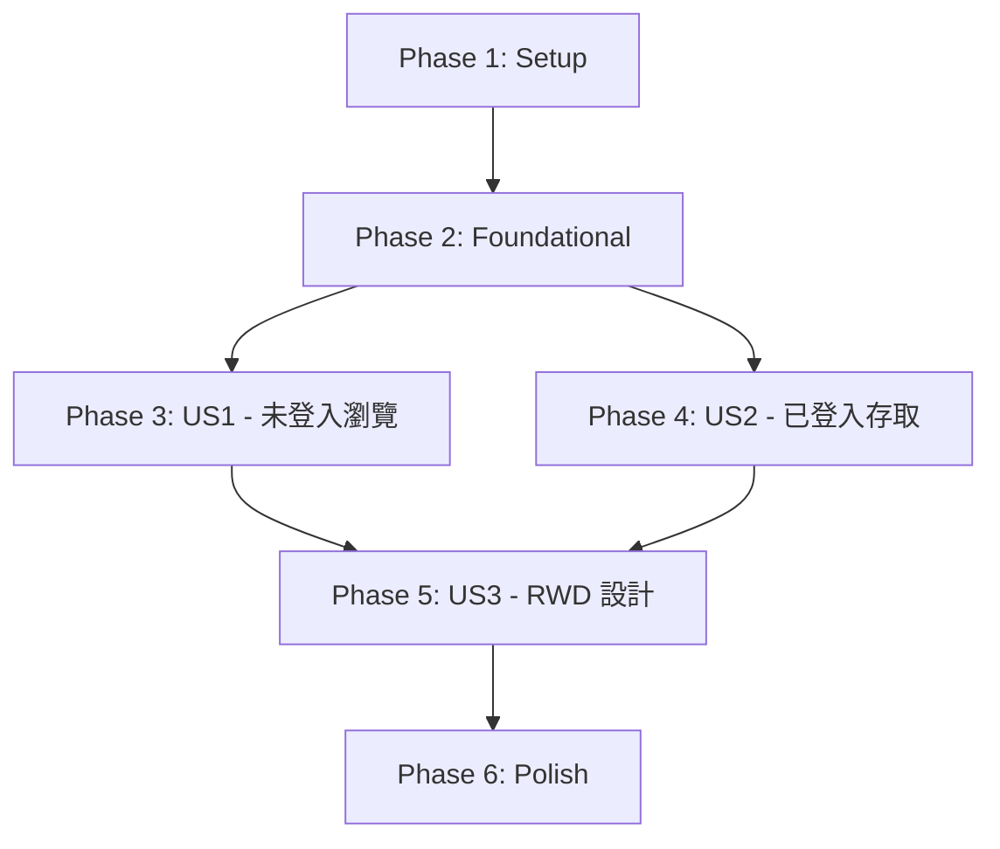

# Tasks: Portal Home

**Feature Branch**: `001-portal-home`  
**Input**: Design documents from `/specs/001-portal-home/`  
**Prerequisites**: [plan.md](plan.md), [spec.md](spec.md), [research.md](research.md), [data-model.md](data-model.md), [contracts/](contracts/)

**Organization**: Tasks grouped by user story (US1-US3) to enable independent implementation and testing.

**Tests**: Test tasks are NOT included per specification - Gate A validation will use existing test infrastructure if needed.

---

## Format: `- [ ] [ID] [P?] [Story?] Description with file path`

- **[P]**: Can run in parallel (different files, no dependencies)
- **[Story]**: User story label (US1, US2, US3) - omit for Setup/Foundational/Polish phases
- Include exact file paths in descriptions

---

## Phase 1: Setup (專案初始化)

**Purpose**: 建立專案結構、安裝套件、設定基礎環境

**Tasks**:

- [X] T001 建立 Blazor Server 專案於 src/Frontend/Saintber.Forge.BlazorServer/（若尚未存在）
- [X] T002 [P] 建立 Persistence 專案於 src/Persistence/Saintber.Forge.Persistence.EF.Postgres/（若尚未存在）
- [X] T003 [P] 建立單元測試專案於 tests/Saintber.Forge.BlazorServer.UnitTests/
- [X] T004 [P] 建立整合測試專案於 tests/Saintber.Forge.BlazorServer.IntegrationTests/
- [X] T005 [P] 安裝 Microsoft.Identity.Web (v2.16.0) 至 BlazorServer 專案
- [X] T006 [P] 安裝 Microsoft.Identity.Web.UI (v2.16.0) 至 BlazorServer 專案
- [X] T007 [P] 安裝 Microsoft.EntityFrameworkCore (v8.0) 至 Persistence 專案
- [X] T008 [P] 安裝 Npgsql.EntityFrameworkCore.PostgreSQL (v8.0) 至 Persistence 專案
- [X] T009 [P] 安裝 bUnit (最新穩定版) 至 UnitTests 專案
- [X] T010 [P] 安裝 Microsoft.Playwright.NUnit (v1.40.0) 至 IntegrationTests 專案
- [X] T011 設定 BlazorServer 專案參考 Persistence 專案
- [X] T012 設定 appsettings.json 結構（AzureAd、ConnectionStrings 區段）於 src/Frontend/Saintber.Forge.BlazorServer/appsettings.json

**Completion Criteria**: 專案結構建立完成，套件已安裝，dotnet restore 與 dotnet build 成功。

---

## Phase 2: Foundational (基礎設施 - 阻塞所有 User Stories)

**Purpose**: 建立資料模型、DbContext、Migration，為所有 User Stories 提供共享基礎

**Tasks**:

- [X] T013 建立 ToolRegistration Entity 於 src/Persistence/Saintber.Forge.Persistence.EF.Postgres/Entities/ToolRegistration.cs（參照 data-model.md）
- [X] T014 [P] 建立 UserIdentity Entity 於 src/Persistence/Saintber.Forge.Persistence.EF.Postgres/Entities/UserIdentity.cs（參照 data-model.md）
- [X] T015 建立 PortalDbContext 於 src/Persistence/Saintber.Forge.Persistence.EF.Postgres/PortalDbContext.cs（包含 DbSet、OnModelCreating、Indexes）
- [X] T016 於 PortalDbContext.OnModelCreating 加入 ToolRegistration Seed Data（2 筆範例：公開 Tool A、受保護 Tool B）
- [X] T017 建立 InitialCreate Migration：dotnet ef migrations add InitialCreate --project src/Persistence/Saintber.Forge.Persistence.EF.Postgres --startup-project src/Frontend/Saintber.Forge.BlazorServer
- [X] T018 於 Program.cs 註冊 DbContext：builder.Services.AddDbContext<PortalDbContext>
- [X] T019 於 Program.cs 註冊 Microsoft Identity：builder.Services.AddMicrosoftIdentityWebAppAuthentication
- [X] T020 於 Program.cs 加入 Middleware 順序：UseAuthentication → UseAuthorization（在 UseRouting 之後）
- [X] T021 建立 IToolRegistrationService 介面於 src/Frontend/Saintber.Forge.BlazorServer/Services/IToolRegistrationService.cs（包含 GetAllToolsAsync、GetPublicToolsAsync）
- [X] T022 建立 ToolRegistrationService 實作於 src/Frontend/Saintber.Forge.BlazorServer/Services/ToolRegistrationService.cs（注入 PortalDbContext）
- [X] T023 於 Program.cs 註冊 ToolRegistrationService：builder.Services.AddScoped<IToolRegistrationService, ToolRegistrationService>

**Completion Criteria**: Migration 可成功套用至資料庫，Seed Data 正確寫入，DI 註冊完成。

---

## Phase 3: User Story 1 - 未登入使用者瀏覽公開功能 (P1 - MVP)

**Goal**: 未登入使用者能看到公開 Tool 卡片並能點擊導覽

**Independent Test**: 在未登入狀態開啟首頁，驗證顯示公開 Tool 卡片且可點擊導覽至 Tool URL

**Tasks**:

- [X] T024 [US1] 建立 ToolCard.razor 元件於 src/Frontend/Saintber.Forge.BlazorServer/Components/ToolCard.razor（接受 ToolRegistration 參數，顯示標題、描述、導覽連結）
- [X] T025 [US1] 建立 ToolCard.razor.css 於 src/Frontend/Saintber.Forge.BlazorServer/Components/ToolCard.razor.css（基本卡片樣式：border、padding、hover 效果）
- [X] T026 [US1] 修改 Pages/Index.razor 於 src/Frontend/Saintber.Forge.BlazorServer/Pages/Index.razor：
  - 注入 AuthenticationStateProvider 與 IToolRegistrationService
  - OnInitializedAsync：檢查 isAuthenticated，若 false 呼叫 GetPublicToolsAsync
  - 以 `
` 包裝 ToolCard 元件迴圈
  - 無 Tool 時顯示「目前無可用功能」訊息
- [X] T027 [US1] 建立基本 CSS Grid 樣式於 src/Frontend/Saintber.Forge.BlazorServer/wwwroot/css/app.css（預設單欄佈局，稍後 US3 擴充 RWD）
- [X] T028 [US1] 執行本地開發環境 Migration：dotnet ef database update --project src/Persistence/Saintber.Forge.Persistence.EF.Postgres --startup-project src/Frontend/Saintber.Forge.BlazorServer
- [X] T029 [US1] 手動驗證：啟動 Blazor Server（dotnet run），開啟瀏覽器訪問 https://localhost:7289，確認顯示公開 Tool 卡片（範例工具 A）

**Completion Criteria**: 未登入狀態下首頁顯示公開 Tool 卡片，點擊卡片可導覽至 Tool URL（即使 Tool 尚未實作，URL 導覽行為正確）。

---

## Phase 4: User Story 2 - 已登入使用者存取完整功能 (P2)

**Goal**: 已登入使用者能看到所有 Tool 卡片（包含受保護的）

**Independent Test**: 完成 Microsoft 登入後，驗證能看到所有 Tool 卡片（公開 + 受保護）並能存取

**Tasks**:

- [X] T030 [US2] 修改 Pages/Index.razor 於 src/Frontend/Saintber.Forge.BlazorServer/Pages/Index.razor：
  - OnInitializedAsync：若 isAuthenticated = true，呼叫 GetAllToolsAsync（而非 GetPublicToolsAsync）
  - 顯示使用者 DisplayName（若已登入）於頁面頂端或導覽列
- [X] T031 [US2] 建立 IUserIdentityService 介面於 src/Frontend/Saintber.Forge.BlazorServer/Services/IUserIdentityService.cs（包含 UpdateLastLoginAsync）
- [X] T032 [US2] 建立 UserIdentityService 實作於 src/Frontend/Saintber.Forge.BlazorServer/Services/UserIdentityService.cs（注入 PortalDbContext，實作 UpdateLastLoginAsync 邏輯）
- [X] T033 [US2] 於 Program.cs 註冊 UserIdentityService：builder.Services.AddScoped<IUserIdentityService, UserIdentityService>
- [X] T034 [US2] 修改 Pages/Index.razor：OnInitializedAsync 中若 isAuthenticated = true，呼叫 UserIdentityService.UpdateLastLoginAsync（記錄登入時間）
- [X] T035 [US2] 設定 Azure AD App Registration（手動操作）：
  - 建立 App Registration（名稱：Saintber.Forge.Portal.Dev）
  - 設定 Redirect URI：https://localhost:7289/signin-oidc
  - 建立 Client Secret
  - 記錄 TenantId、ClientId、ClientSecret
- [X] T036 [US2] 使用 dotnet user-secrets 設定 Azure AD 資訊：
  - dotnet user-secrets set "AzureAd:TenantId" "<YOUR_TENANT_ID>"
  - dotnet user-secrets set "AzureAd:ClientId" "<YOUR_CLIENT_ID>"
  - dotnet user-secrets set "AzureAd:ClientSecret" "<YOUR_CLIENT_SECRET>"
- [X] T037 [US2] 手動驗證:啟動 Blazor Server,點擊「登入」按鈕,完成 Microsoft 登入,確認返回首頁後顯示所有 Tool 卡片(範例 Tool A + Tool B)

**Completion Criteria**: 登入用戶能看到所有 Tool 卡片（包含 IsPublic=false 的 Tool），UserIdentity 表格正確記錄登入時間。

---

## Phase 5: User Story 3 - RWD 響應式設計支援 (P3)

**Goal**: 首頁在不同螢幕寬度下佈局自動調整（桌機 4 欄、平板 2 欄、手機 1 欄）

**Independent Test**: 使用 Chrome DevTools 調整視窗寬度，驗證卡片佈局正確切換

**Tasks**:

- [X] T038 [US3] 修改 wwwroot/css/app.css 於 src/Frontend/Saintber.Forge.BlazorServer/wwwroot/css/app.css：
  - 加入 Media Query：@media (min-width: 768px) and (max-width: 1199px) → grid-template-columns: repeat(2, 1fr)
  - 加入 Media Query：@media (min-width: 1200px) → grid-template-columns: repeat(4, 1fr)
  - 預設（< 768px）維持單欄：grid-template-columns: 1fr
- [X] T039 [US3] 優化 ToolCard.razor.css 於 src/Frontend/Saintber.Forge.BlazorServer/Components/ToolCard.razor.css：
  - 確保卡片 max-width 與 padding 在小螢幕下不產生水平捲軸
  - 加入 responsive font-size（可選，視覺優化）
- [X] T040 [US3] 手動驗證（Gate B）：
  - 開啟 Chrome DevTools → Toggle Device Toolbar
  - 測試 1920px（桌機）：驗證 4 欄佈局
  - 測試 800px（平板）：驗證 2 欄佈局
  - 測試 375px（手機）：驗證單欄佈局
  - 確認無水平捲軸
- [X] T041 [US3] （可選）建立 Playwright RWD 自動化測試於 tests/Saintber.Forge.BlazorServer.IntegrationTests/E2E/PortalHomeRwdTests.cs（參照 research.md R5 測試範例）

**Completion Criteria**: 首頁在三種螢幕寬度下佈局正確，無水平捲軸，卡片可正常點擊。

---

## Phase 6: Polish & Cross-Cutting Concerns (最終整理)

**Purpose**: 錯誤處理、Edge Cases、效能優化、文件完善

**Tasks**:

- [X] T042 處理 Edge Case：Index.razor 中，若 visibleTools.Count == 0，顯示友善訊息「目前無可用功能」（US1 已包含，確認實作）
- [X] T043 處理 Token 過期情境：Index.razor 中，若 AuthenticationStateProvider 回傳 isAuthenticated = false（Token 過期），自動降級為公開 Tool 模式（US2 Acceptance Scenario 4）
- [X] T044 [P] 優化 ToolRegistrationService 查詢：確保 GetAllToolsAsync 與 GetPublicToolsAsync 使用 .AsNoTracking()（僅讀取，無需追蹤）
- [X] T045 [P] 加入 Logging：ToolRegistrationService 與 UserIdentityService 注入 ILogger，記錄查詢與錯誤
- [X] T046 建立 appsettings.Development.json 於 src/Frontend/Saintber.Forge.BlazorServer/appsettings.Development.json（設定詳細 Logging Level 為 Debug）
- [X] T047 更新 README.md 於 specs/001-portal-home/README.md（若尚未存在，建立）：記錄本地開發快速啟動步驟（參照 quickstart.md）
- [X] T048 執行完整 Gate A 驗證：
  - dotnet restore（確認套件還原成功）
  - dotnet build（確認 Errors = 0）
  - dotnet test --filter Category=Unit（若有單元測試）
- [X] T049 建立 Verification Record 於 docs/plan/verification/001-portal-home.verify.md（記錄 Gate A 執行結果、Gate B 手動驗證結果）

**Completion Criteria**: 所有 Edge Cases 正確處理，Logging 完善，Gate A 通過，Verification Record 已建立。

---

## Dependencies (User Story 完成順序)

**Critical Path**: Setup → Foundational → US1（MVP 可在此交付）

**Parallel Opportunities**:
- Phase 1 中 T003-T010（測試專案與套件安裝可並行）
- Phase 2 中 T013-T014（兩個 Entity 可並行建立）
- Phase 4 與 Phase 5 可在 US1 穩定後並行開發（US2 處理登入，US3 處理 RWD）

---

## Parallel Execution Examples

### Example 1: Phase 1 Setup（最大化並行）

**批次 1（無相依）**:
- T001（BlazorServer 專案）
- T002（Persistence 專案）
- T003（UnitTests 專案）
- T004（IntegrationTests 專案）

**批次 2（需專案存在）**:
- T005-T010（套件安裝，可全部並行）

**批次 3（需專案與套件）**:
- T011（專案參考）
- T012（appsettings 設定）

### Example 2: Phase 3 US1（獨立交付 MVP）

**批次 1**:
- T024（ToolCard.razor）
- T025（ToolCard.razor.css）

**批次 2**:
- T026（Index.razor，依賴 ToolCard 元件）
- T027（app.css，可與 T026 並行）

**批次 3**:
- T028（Migration 套用）
- T029（手動驗證）

---

## Implementation Strategy

### MVP Scope（建議最小可交付範圍）

**僅實作 User Story 1（Phase 1-3）**：
- Setup + Foundational + US1
- 任務範圍：T001-T029
- 交付成果：未登入使用者能瀏覽公開 Tool 卡片並導覽
- 預估工時：2-3 天（含環境設定與 Migration）

### Incremental Delivery（漸進式交付）

1. **Sprint 1**: US1（MVP）→ Gate A 驗證 → 使用者回饋
2. **Sprint 2**: US2（登入功能）→ Gate A 驗證 → 整合測試
3. **Sprint 3**: US3（RWD 優化）→ Gate B 手動驗證 → 完整交付
4. **Sprint 4**: Polish → Verification Record → 結案

---

## Success Metrics Mapping

| Success Criteria | 驗證任務 | 驗證方式 |
|------------------|---------|---------|
| SC-001: 未登入首頁載入 < 3 秒 | T029 | 手動計時或瀏覽器 Performance Tab |
| SC-002: 已登入首頁載入 < 3 秒 | T037 | 手動計時或瀏覽器 Performance Tab |
| SC-003: 卡片點擊成功率 100% | T029, T037 | 手動點擊所有卡片，確認 URL 正確導覽 |
| SC-004: RWD 佈局正確 | T040 | Chrome DevTools 三種寬度測試 |
| SC-005: 新增 Tool 自動顯示 | T016 | 修改 Seed Data，重新 Migration，驗證新卡片出現 |
| SC-006: 90% 用戶能找到目標 Tool | T040 | 人工觀察測試或問卷（非自動化） |

---

## Total Task Count

- **Phase 1 (Setup)**: 12 tasks
- **Phase 2 (Foundational)**: 11 tasks
- **Phase 3 (US1 - MVP)**: 6 tasks
- **Phase 4 (US2)**: 8 tasks
- **Phase 5 (US3)**: 4 tasks
- **Phase 6 (Polish)**: 8 tasks

**Total**: 49 tasks

**Parallelizable**: 18 tasks (標註 [P])

**MVP Minimum**: 29 tasks (Phase 1-3)

---

## Format Validation

✅ All tasks follow checklist format: `- [ ] [TaskID] [P?] [Story?] Description with file path`  
✅ Task IDs sequential: T001-T049  
✅ User Story labels applied: [US1], [US2], [US3]  
✅ File paths included in all implementation tasks  
✅ Parallel markers [P] applied to independent tasks  
✅ Setup/Foundational/Polish phases have no [Story] label  
✅ User Story phases (3-5) have [Story] label

**Ready for Implementation**: ✅ Yes
